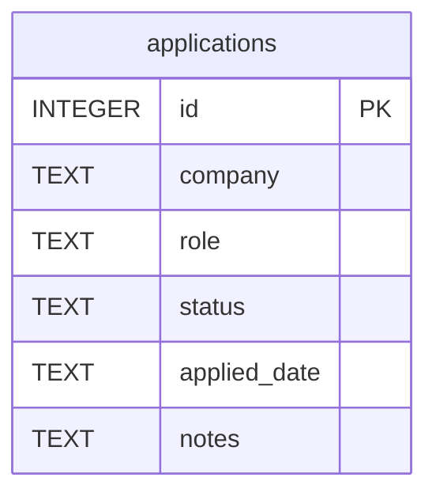

# Design: As a user, I want to manage job applications via a cohesive REST API with SQLite persistence so I can create, view, update, and delete applications with proper defaults and validation.

## Overview
Build a REST API using Express and SQLite (better-sqlite3) with a thin repository layer, input validation, and consistent JSON errors. Defaults (status, applied_date) are set in the API; DB enforces integrity via NOT NULL and CHECK constraints. Endpoints support CRUD with optional status filtering.

## Components
- app.ts: Express app bootstrap, JSON parsing, routes, error middleware.
- db/connection.ts: Open SQLite database, configure pragmas (foreign_keys=ON), expose handle.
- db/schema.ts: Ensure table and indexes exist on startup.
- repositories/ApplicationRepository.ts:
  - create(data)
  - list()
  - listByStatus(status)
  - getById(id)
  - update(id, patch)
  - delete(id)
- validation/applicationValidator.ts:
  - validateAndNormalize(body, mode) where mode in {create, update}
  - validateId(param)
  - validateStatus(value)
  - todayUtcDate()
- routes/applicationsRouter.ts: Define REST routes; parse query/params; call repo; map results and errors.
- middleware/errorHandler.ts: Convert thrown errors to { error } JSON with proper HTTP status.
- tests/applications.test.ts: Jest + supertest happy paths and validation failures.

## Data Flow
- Startup:
  1) app.ts loads db/connection, db/schema to create table.
- POST /applications:
  1) Validate body; default status=applied, applied_date=todayUtcDate() if absent.
  2) repo.create inserts and returns row; 201 with JSON.
- GET /applications:
  1) If ?status present, validate enum then repo.listByStatus; else repo.list.
  2) 200 with JSON array.
- GET /applications/:id:
  1) validateId; repo.getById; 404 if null; else 200 with JSON.
- PUT /applications/:id:
  1) validateId; validateAndNormalize(body, update) allowing partial; 400 if empty patch.
  2) repo.update returns updated row count; 404 if none; else fetch and return 200 with JSON.
- DELETE /applications/:id:
  1) validateId; repo.delete; 404 if none; else 204 no body.

## Diagram

## Key Decisions
- Decision: Express + better-sqlite3 — Rationale: Simple, fast, zero-ORM with sync SQL.
- Decision: Defaults in API layer — Rationale: Clear behavior and easier tests; DB still enforces CHECK.
- Decision: PUT as partial update — Rationale: Simpler client usage; validated per-field if present.
- Decision: Date format YYYY-MM-DD UTC — Rationale: Stable, unambiguous.

## Edge Cases & Risks
- Invalid status in query/body: return 400 with { error }.
- Empty strings for company/role: trim and reject as 400.
- Empty PATCH on PUT: 400.
- Non-integer id: 400; missing record: 404.
- SQLite concurrency: better-sqlite3 is safe in single process; avoid long transactions.
- Timezone drift: todayUtcDate uses UTC; document in API.

## Acceptance Criteria (Technical)
- [ ] SQLite table with schema and status CHECK plus status index.
- [ ] POST sets defaults, validates, returns 201 with created row.
- [ ] GET list and filtered by status; invalid status 400.
- [ ] GET by id returns 200 or 404.
- [ ] PUT validates partials, returns 200 updated or 404/400.
- [ ] DELETE returns 204 or 404.
- [ ] All errors return JSON { error }.
- [ ] Tests cover happy paths and validation failures.