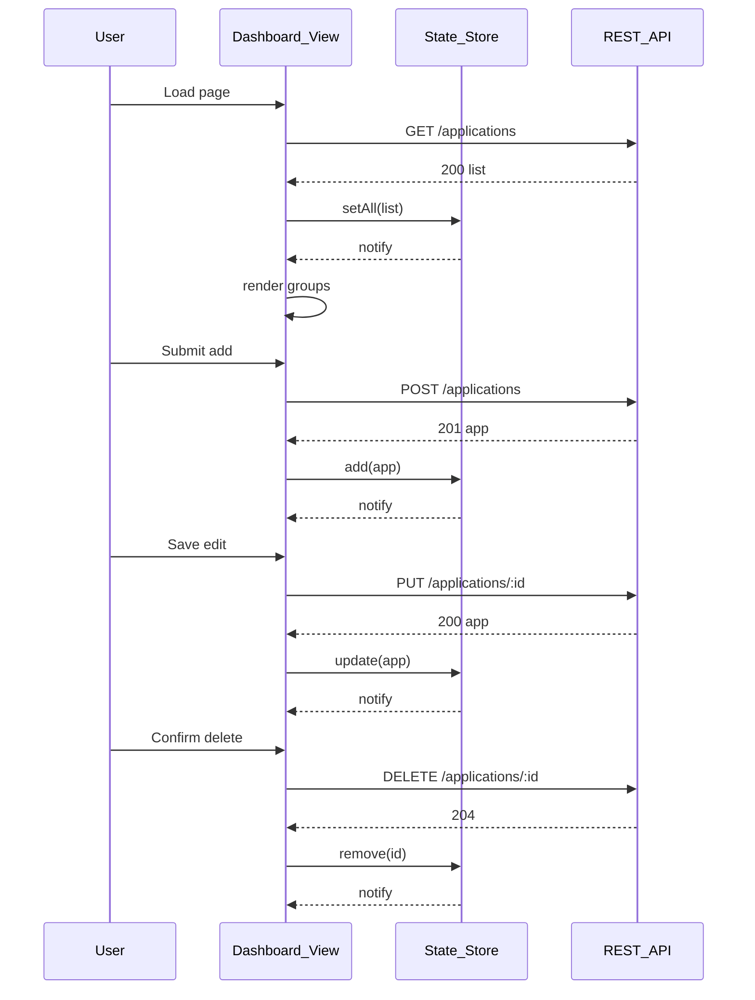

# Design: As a user, I want a single-page dashboard to view applications grouped by status and to add, edit, delete, and change status directly from the list.

## Overview
Implement a single-page dashboard that fetches applications via REST, renders four grouped columns by status, and supports inline add/edit/delete/status changes without full reloads. Use a small, framework-agnostic ES module architecture with a central state store, a fetch-based API client, and event-driven UI updates.

## Components
- ApiClient: fetch wrapper with methods getApplications, createApplication, updateApplication, deleteApplication; normalizes errors.
- StateStore: holds applications Map by id; exposes selectors for groups; pub-sub for updates.
- DashboardController: bootstraps load, wires events, coordinates store and views.
- GroupColumnView: renders a status column (Applied, Interviewing, Offer, Rejected); handles empty state.
- ApplicationRowView: renders a row; supports inline edit, status dropdown, delete.
- ApplicationFormView: inline form or modal for add/edit; client-side validation.
- NotificationService: success/error toasts.
- Validator: schema for required fields, status enum, date format.
- ConfirmDialog: confirm delete.

## Data Flow
1. Init: DashboardController calls ApiClient.getApplications(); on success, StateStore.setAll(); views render columns via selectors.
2. Add: User opens form; Validator checks inputs; ApiClient.createApplication(body); server defaults status=applied and applied_date=today if omitted; on 201, StateStore.add(app); UI re-renders correct column; notify success; on 4xx, show inline messages; on error, toast.
3. Edit: Row enters edit mode; on submit, Validator; ApiClient.updateApplication(id, body); on 200, StateStore.update(app); if status changed, row moves columns; notify success; on 4xx, show inline; on error, revert UI and toast.
4. Delete: User confirms; ApiClient.deleteApplication(id); on 204, StateStore.remove(id); UI removes row; notify success; on error, restore row and toast.
5. Change Status: User selects new status; disable controls; ApiClient.updateApplication(id, {status}); on 200, StateStore.update(app); move row; on error, revert selection and toast.

## Diagram

## Key Decisions
- Decision: Framework-agnostic ES modules — Rationale: Simple SPA without heavy dependencies.
- Decision: Central StateStore with pub-sub — Rationale: Consistent updates across grouped views.
- Decision: Pessimistic updates — Rationale: Avoid UI/server divergence and complex rollbacks.

## Edge Cases & Risks
- Network failures: disable controls during requests; show retry toast.
- API validation errors: map field errors to form inputs; keep user data intact.
- Status enum drift: guard with client enum and server error handling.
- Timezone for applied_date: display in local; send/parse ISO dates.
- Concurrent edits: last-write-wins; refresh row from server response.
- Empty groups: show “No applications” placeholders.

## Acceptance Criteria (Technical)
- [ ] GET /applications on load renders four groups with correct rows and empty states.
- [ ] POST without status/applied_date yields applied with today’s date; new row appears in Applied.
- [ ] PUT /applications/:id updates fields; UI reflects changes immediately; status change moves row.
- [ ] DELETE /applications/:id after confirm removes row; errors restore row.
- [ ] Inline validation messages shown on client and server 4xx errors.
- [ ] All actions occur without full page reload; toasts show success/error.