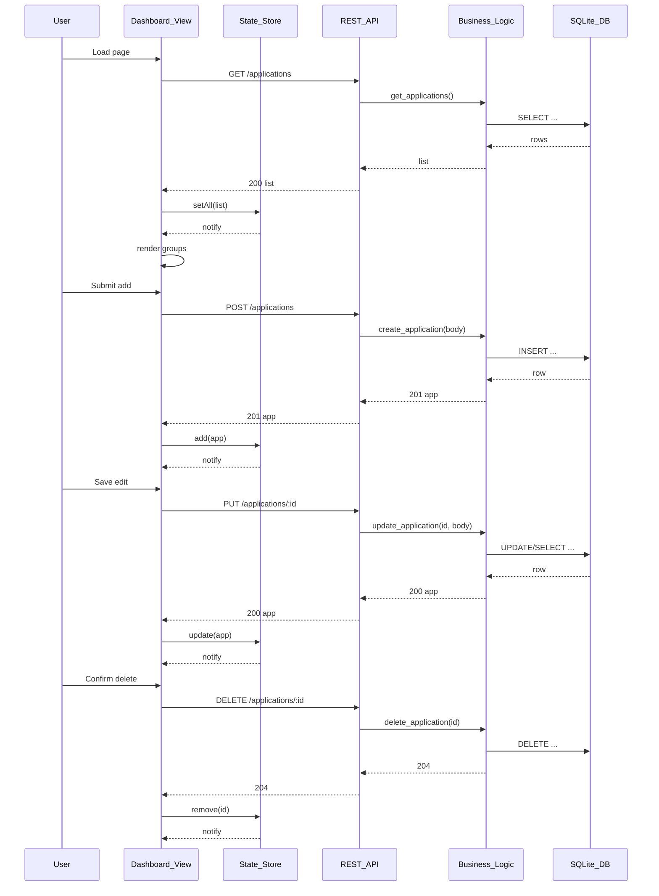

# Design: As a user, I want a single-page dashboard to view applications grouped by status and to add, edit, delete, and change status directly from the list.

## Overview
Implement a single-page dashboard that fetches applications via REST, renders four grouped columns by status, and supports inline add/edit/delete/status changes without full reloads. The frontend uses a small, framework-agnostic ES module architecture with a central state store, a fetch-based API client, and event-driven UI updates.

The backend is a Python business-logic module with SQLite persistence that provides CRUD operations, grouping by status, server-side validation, and sensible defaults. A thin REST layer maps HTTP requests to this business logic and normalizes errors for the client.

## Components
- ApiClient (frontend): fetch wrapper with methods getApplications, createApplication, updateApplication, deleteApplication; normalizes errors from REST.
- StateStore (frontend): holds applications Map by id; exposes selectors for groups; pub-sub for updates.
- DashboardController (frontend): bootstraps load, wires events, coordinates store and views.
- GroupColumnView (frontend): renders a status column (Applied, Interviewing, Offer, Rejected); handles empty state.
- ApplicationRowView (frontend): renders a row; supports inline edit, status dropdown, delete.
- ApplicationFormView (frontend): inline form or modal for add/edit; client-side validation for UX.
- NotificationService (frontend): success/error toasts.
- Validator (frontend): schema for required fields, status enum, date format; server remains source of truth.
- ConfirmDialog (frontend): confirm delete.

- REST Layer (server): thin HTTP layer exposing:
  - GET /applications
  - POST /applications
  - PUT /applications/:id (supports partial updates)
  - DELETE /applications/:id
  - Optional: GET /applications/grouped or client groups locally
  Maps ValidationError to 400 with field_errors payload, NotFoundError to 404, and unexpected errors to 5xx.

- ApplicationService (server business logic; Python module):
  - Functions: get_applications, get_application_by_id, create_application, update_application (partial), change_application_status, delete_application, group_applications_by_status.
  - Enforces allowed statuses: applied, interviewing, offer, rejected.
  - Defaults create: status="applied", applied_date=today when omitted.
  - Validates fields and formats; returns dicts with ISO 8601 created_at/updated_at.
  - Orders results by applied_date DESC then id DESC.

- Persistence (server):
  - SQLite database with applications table (schema created on first use).
  - WAL mode enabled where possible for better concurrency.
  - Indexes on status and applied_date.

## Data Flow
1. Init:
   - DashboardController calls ApiClient.getApplications().
   - REST layer invokes ApplicationService.get_applications() (SQLite-backed) and returns list.
   - On success, StateStore.setAll(); views render columns via selectors (client may group locally; alternatively, use grouped endpoint).

2. Add:
   - User opens form; frontend Validator checks inputs.
   - ApiClient.createApplication(body) -> REST -> ApplicationService.create_application(body).
   - Server defaults status=applied and applied_date=today if omitted.
   - On 201, StateStore.add(app); UI re-renders correct column; notify success.
   - On 4xx with field errors, show inline messages; on network/server error, toast.

3. Edit:
   - Row enters edit mode; on submit, frontend Validator.
   - ApiClient.updateApplication(id, body) -> REST -> ApplicationService.update_application(id, body) (partial updates allowed).
   - On 200, StateStore.update(app); if status changed, row moves columns; notify success.
   - On 4xx, show inline; on error, revert UI and toast.

4. Delete:
   - User confirms; ApiClient.deleteApplication(id) -> REST -> ApplicationService.delete_application(id).
   - On 204, StateStore.remove(id); UI removes row; notify success.
   - On error, restore row and toast.

5. Change Status:
   - User selects new status; disable controls; ApiClient.updateApplication(id, {status}) -> REST -> ApplicationService.change_application_status(id, status).
   - On 200, StateStore.update(app); move row; on error, revert selection and toast.

## Diagram

## Key Decisions
- Decision: Framework-agnostic ES modules for frontend — Rationale: Simple SPA without heavy dependencies.
- Decision: Central StateStore with pub-sub — Rationale: Consistent updates across grouped views.
- Decision: Pessimistic updates on client — Rationale: Avoid UI/server divergence and complex rollbacks.
- Decision: Server-side business logic with SQLite persistence — Rationale: Lightweight, embedded storage suitable for a small app; simple deployment.
- Decision: Server-side validation as source of truth — Rationale: Enforce constraints (required fields, status enum, date format); client validates for UX but must handle server field_errors.
- Decision: ISO timestamps and date handling — Rationale: created_at/updated_at as ISO 8601 UTC; applied_date as YYYY-MM-DD; client displays in local time.

## Edge Cases & Risks
- Network failures: disable controls during requests; show retry toast.
- API validation errors: REST maps server ValidationError.field_errors to JSON; client maps to form inputs; keep user data intact.
- Status enum drift: client uses enum from server; server validates; unexpected legacy values grouped under applied on server grouping.
- Timezone for applied_date: display in local; send/parse ISO dates; server enforces YYYY-MM-DD.
- Concurrent edits: last-write-wins; refresh row from server response (updated_at changes).
- Empty groups: show “No applications” placeholders.
- Database concurrency/locks: SQLite WAL mode enabled; operations are short-lived; handle busy errors with retries in REST layer if needed.
- NotFound cases: map to 404; client restores UI state on delete/update of missing items.

## Acceptance Criteria (Technical)
- [ ] GET /applications on load renders four groups with correct rows and empty states (client may group locally; ordering by applied_date DESC then id DESC).
- [ ] POST without status/applied_date yields applied with today’s date; new row appears in Applied; server returns created_at/updated_at ISO timestamps.
- [ ] PUT /applications/:id supports partial updates; UI reflects changes immediately; status change moves row.
- [ ] DELETE /applications/:id after confirm removes row; errors restore row.
- [ ] Inline validation messages shown on client for client-side checks and mapped from server 4xx errors with field_errors.
- [ ] All actions occur without full page reload; toasts show success/error.
- [ ] Server enforces allowed statuses (applied, interviewing, offer, rejected); invalid inputs return 400 with field_errors.
- [ ] Not found IDs return 404 for GET/PUT/DELETE.
- [ ] SQLite schema is created on first use; indexes on status and applied_date exist.