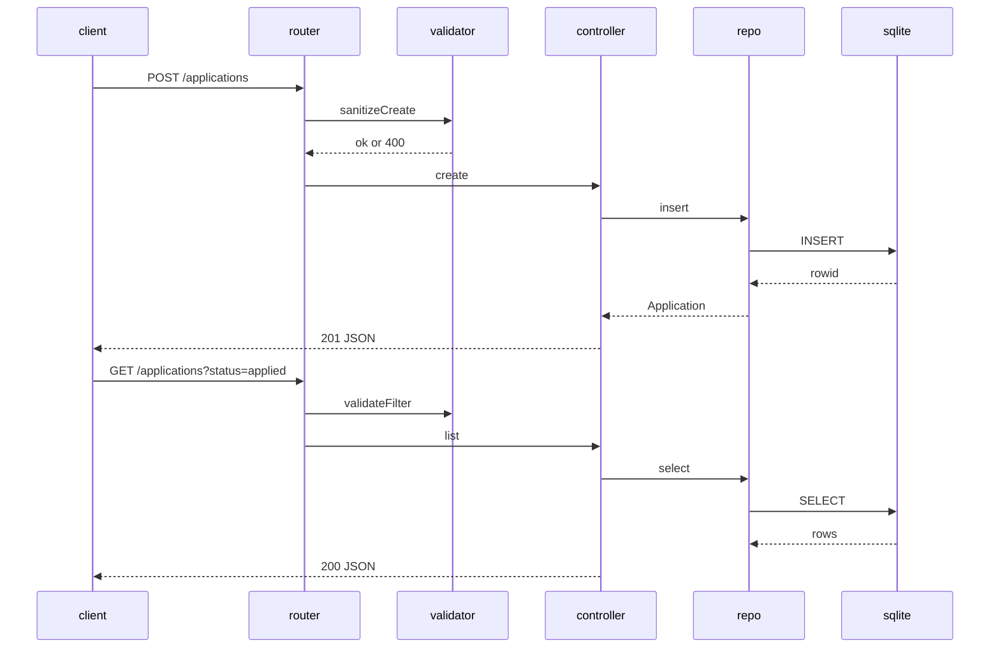

# Design: As a user, I want to create, view, update, delete, and filter job applications via a REST API so I can track their lifecycle.

## Overview
Build a small Express-based REST API backed by SQLite. Implement a single applications table with CHECK constraint for status. Use layered modules: routing, validation, controller, repository, and DB. Enforce input trimming, enum validation, and ISO date formatting (YYYY-MM-DD). Provide consistent JSON errors and appropriate HTTP status codes.

## Components
- db.ts
  - initDB(): open SQLite file, run schema migration
  - getDB(): return singleton DB handle (parameterized queries)
  - Schema: CREATE TABLE IF NOT EXISTS applications (id INTEGER PRIMARY KEY AUTOINCREMENT, company TEXT NOT NULL, role TEXT NOT NULL, status TEXT NOT NULL CHECK(status IN ('applied','interviewing','offer','rejected')), applied_date TEXT NOT NULL, notes TEXT)
- models.ts
  - Types: Application, NewApplication, UpdateApplication
- validators.ts
  - validateStatus(s): enum check
  - validateDate(s): YYYY-MM-DD check
  - sanitizeCreate(body): trim strings, default status=applied, default applied_date=utcToday()
  - sanitizeUpdate(body): trim strings, forbid id, validate provided fields
  - validateFilter(query): optional status check
- repo.ts
  - create(app: NewApplication): Application
  - getById(id: number): Application | null
  - list(filter?: {status?: string}): Application[]
  - update(id: number, patch: UpdateApplication): Application | null
  - delete(id: number): boolean
- controller.ts
  - postApplications, getApplications, getApplicationById, putApplication, deleteApplication
- routes.ts
  - Mount REST routes to controllers
- middleware/errorHandler.ts
  - Map thrown {status,message} to JSON error responses
- utils/date.ts
  - utcToday(): string (YYYY-MM-DD)

## Data Flow
1) Client sends HTTP request.
2) routes.ts matches path and method.
3) validators.ts sanitizes and validates input; on error, throw {status:400,message}.
4) controller.ts invokes repo.ts.
5) repo.ts executes parameterized SQL via db.ts.
6) Rows mapped to Application objects; dates kept as text YYYY-MM-DD.
7) controller.ts sends JSON with proper status code.
8) Errors propagate to errorHandler for JSON error response.

## Diagram

## Key Decisions
- Decision: Use CHECK for status — Rationale: Enforce enum at DB level.
- Decision: Store dates as TEXT YYYY-MM-DD — Rationale: Simple, comparable, meets API format.
- Decision: Default dates in app layer — Rationale: UTC consistency using utcToday().
- Decision: Ignore id in PUT body — Rationale: Id is immutable; prevents accidental changes.
- Decision: Prepared statements — Rationale: Prevent SQL injection.

## Edge Cases & Risks
- Empty company/role after trim: return 400.
- Invalid status or date format: 400; validate strictly.
- Nonexistent id on GET/PUT/DELETE: 404.
- applied_date in future/past: allowed (no business rule).
- SQLite concurrency: use single connection; serialize queries.
- 204 DELETE: no response body.

## Acceptance Criteria (Technical)
- [ ] All endpoints return specified status codes and JSON shape, including errors.
- [ ] Validation: trimming, enum, date format enforced; defaults applied on POST.
- [ ] SQLite table created with CHECK constraint; CRUD persists correctly.
- [ ] Tests cover happy paths and validation errors for each endpoint.