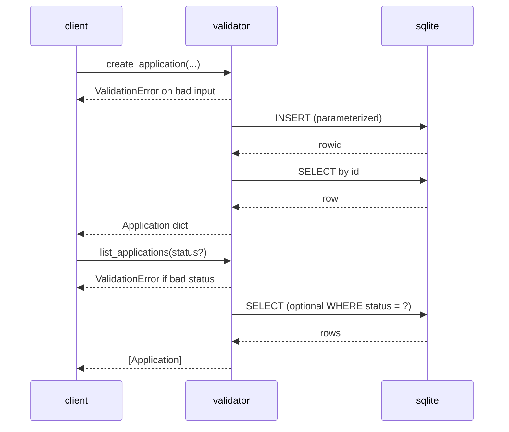

# Design: As a user, I want to create, view, update, delete, and filter job applications via a Python module backed by SQLite so I can track their lifecycle.

## Overview
Build a small Python module using sqlite3 that encapsulates business logic for managing job applications. Implement a single applications table with CHECK constraint for status. Provide a cohesive set of functions that perform validation (trimming, enum validation, and ISO date formatting YYYY-MM-DD with calendar validity) and execute parameterized SQL. Errors are raised as typed exceptions carrying HTTP-like status codes to facilitate consistent error handling by callers.

## Components
- scrum_121.py
  - Errors
    - AppError(status: int, message: str): base exception with status and message
    - ValidationError: AppError with status=400
    - NotFoundError: AppError with status=404
  - DB helpers
    - _ensure_schema(conn): create table if not exists; commit
    - Schema: CREATE TABLE IF NOT EXISTS applications (id INTEGER PRIMARY KEY AUTOINCREMENT, company TEXT NOT NULL, role TEXT NOT NULL, status TEXT NOT NULL CHECK(status IN ('applied','interviewing','offer','rejected')), applied_date TEXT NOT NULL, notes TEXT)
    - Per-call connections using sqlite3.connect(db_path), default db_path="demo.db"
  - Utilities
    - _utc_today(): return today's date string in YYYY-MM-DD
    - _trim(s): trim strings; pass through None
    - _validate_status(s): enum check against {'applied','interviewing','offer','rejected'}
    - _validate_date_string(s): YYYY-MM-DD regex plus calendar validity via datetime.strptime
    - _row_to_application(row): map sqlite3.Row to dict
  - Public API (business/repository)
    - create_application(company, role, status?, applied_date?, notes?, db_path?): dict Application
      - Trims, defaults status='applied', applied_date=_utc_today(), lowercases status, validates inputs, inserts row, returns full record
    - list_applications(status?, db_path?): list[dict Application]
      - Optional status filter (validated and normalized to lowercase)
    - get_application_by_id(app_id, db_path?): dict Application | None
      - Returns None if not found
    - require_application_by_id(app_id, db_path?): dict Application
      - Raises NotFoundError if not found
    - update_application(app_id, company?, role?, status?, applied_date?, notes?, db_path?): dict Application
      - Validates provided fields; raises ValidationError if no updatable fields; raises NotFoundError if id not found; returns updated record
    - delete_application(app_id, db_path?): bool
      - Returns True if a row was deleted, False if not found
    - validate_filter_status(status?: str): Optional[str]
      - Validates optional status filter and returns normalized value

- Data shapes
  - Application: dict with keys {id: int, company: str, role: str, status: str, applied_date: str, notes: Optional[str]}

## Data Flow
1) Caller invokes a public API function (e.g., create_application or list_applications).
2) Inputs are trimmed and validated; on validation failure, raise ValidationError (status 400).
3) Function opens a sqlite3 connection to the specified db_path and calls _ensure_schema.
4) Execute parameterized SQL statements.
5) Rows are mapped to Application dicts; dates are kept as text YYYY-MM-DD.
6) Function returns data (dict/list/bool) or raises NotFoundError (404) where appropriate.
7) Exceptions propagate to the caller for consistent error handling.

## Diagram

## Key Decisions
- Decision: Use CHECK for status — Rationale: Enforce enum at DB level.
- Decision: Store dates as TEXT YYYY-MM-DD — Rationale: Simple, comparable, meets API format expectations for callers.
- Decision: Default dates in module layer — Rationale: Consistency by setting date via _utc_today() when not provided.
- Decision: Normalize status to lowercase — Rationale: Consistent storage and filtering.
- Decision: Parameterized queries — Rationale: Prevent SQL injection.
- Decision: Per-call sqlite3 connections with schema ensured each call — Rationale: Simplicity for a small module without global singletons.
- Decision: Raise typed exceptions with status codes — Rationale: Allows upstream layers (e.g., REST API or CLI) to map to appropriate error handling.

## Edge Cases & Risks
- Empty company/role after trim: raise ValidationError (400).
- Invalid status or date format, or invalid calendar date: raise ValidationError (400).
- Nonexistent id:
  - get_application_by_id: return None.
  - require_application_by_id / update_application: raise NotFoundError (404).
  - delete_application: return False.
- applied_date in future/past: allowed (no business rule).
- SQLite concurrency: per-call connections; callers should avoid long-running transactions; no cross-call transaction support.
- _utc_today uses system date; if strict UTC midnight boundaries are required, adjust implementation.

## Acceptance Criteria (Technical)
- [ ] Public functions perform trimming, enum, and date validation; defaults applied on create_application.
- [ ] SQLite table created with CHECK constraint; CRUD persists correctly using parameterized SQL.
- [ ] Dates are stored and returned as strings in YYYY-MM-DD.
- [ ] Exceptions provide consistent status and message: ValidationError (400), NotFoundError (404).
- [ ] list_applications supports optional validated status filter.
- [ ] Unit tests cover happy paths and validation errors for each function.