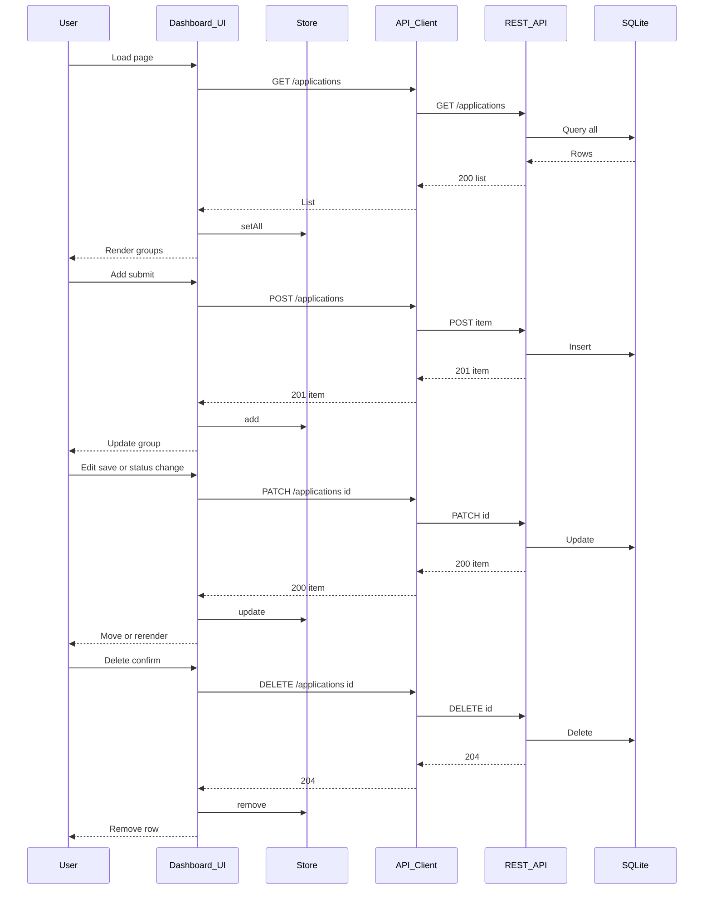

# Design: As a user, I want a single-page dashboard that lists applications grouped by status and lets me add, edit, delete, and change status per row.

## Overview
A single static HTML page with vanilla JS renders applications grouped by status using an in-memory store. A lightweight API client talks to the SQLite-backed REST API for CRUD. UI updates are pessimistic (apply after server success) and reflect changes immediately by re-rendering affected groups. Inline edit forms, status dropdowns, and delete confirmation are handled via event delegation. Dates are stored and displayed as YYYY-MM-DD.

## Components
- index.html: Containers for groups Applied, Interviewing, Offer, Rejected; Add form; inline error region; templates.
- api_client.js:
  - getApplications()
  - createApplication(payload)
  - updateApplication(id, patch)
  - deleteApplication(id)
- store.js:
  - state: applications[]
  - setAll(list), add(item), update(id, patch), remove(id)
  - byStatus(status), allStatuses()
- ui_renderer.js:
  - renderDashboard()
  - renderGroup(status)
  - renderRow(item)
  - renderEmpty(status)
  - showError(targetId, message), clearError(targetId)
- controllers.js:
  - initEventHandlers()
  - onAddSubmit(e)
  - onEditClick(id), onEditSave(id), onEditCancel(id)
  - onStatusChange(id, newStatus)
  - onDeleteClick(id), onDeleteConfirm(id)
- validators.js:
  - validateCreate({company, role, status?, applied_date?, notes?})
  - validateUpdate(patch)
  - formatDate(dateObj) -> YYYY-MM-DD
  - parseDate(str) -> Date or error
- constants.js: STATUSES = [applied, interviewing, offer, rejected]

## Data Flow
1. Page load: controllers.initEventHandlers(); api_client.getApplications() -> store.setAll(); ui_renderer.renderDashboard().
2. Render: For each status, renderGroup(); if empty, renderEmpty().
3. Add: onAddSubmit validates; defaults status=applied, applied_date=today; api_client.createApplication(); on 201 store.add(); renderGroup(applied); clear form; on error showError at form.
4. Edit: onEditClick toggles row to inline form; onEditSave validates patch; api_client.updateApplication(); on 200 store.update(); re-render source and target groups if status changed; on error showError at row; onEditCancel restores original row.
5. Change status: onStatusChange sends api_client.updateApplication(id, {status}); on success move row between groups; on error revert dropdown and showError.
6. Delete: onDeleteClick opens confirm UI; onDeleteConfirm calls api_client.deleteApplication(); on 204 store.remove(); re-render affected group; on error showError.
7. Errors: API errors parsed as JSON {error}; fallback to generic message. Errors announced via aria-live region.

## Diagram

## Key Decisions
- Decision: Client groups by status — Rationale: API returns flat list; reduces server complexity.
- Decision: Use PATCH for updates — Rationale: Inline edits change partial fields.
- Decision: Pessimistic updates — Rationale: Avoid UI-server drift and complex rollback.
- Decision: Date format YYYY-MM-DD — Rationale: Locale-agnostic, matches storage.

## Edge Cases & Risks
- Concurrent edits or deletes: Refresh row on 409 or 404; showError and re-fetch item.
- Network failures: Disable buttons during requests; re-enable on failure; showError.
- Validation errors (422): Display field-level messages; keep user input.
- Timezone issues: Use local date for default; restrict input type=date; store/display YYYY-MM-DD.
- Large lists: Use event delegation and targeted re-rendering per group.

## Acceptance Criteria (Technical)
- [ ] GET renders four groups with empty states, rows with required fields, dates as YYYY-MM-DD.
- [ ] Add form validates, posts, and inserts into Applied without reload; errors shown inline.
- [ ] Inline edit updates fields via PATCH; Cancel restores; errors shown inline.
- [ ] Status dropdown PATCH moves row between groups.
- [ ] Delete requires confirmation, calls DELETE, and removes row.
- [ ] All API errors surface inline via aria-live; controls re-enabled after failure.