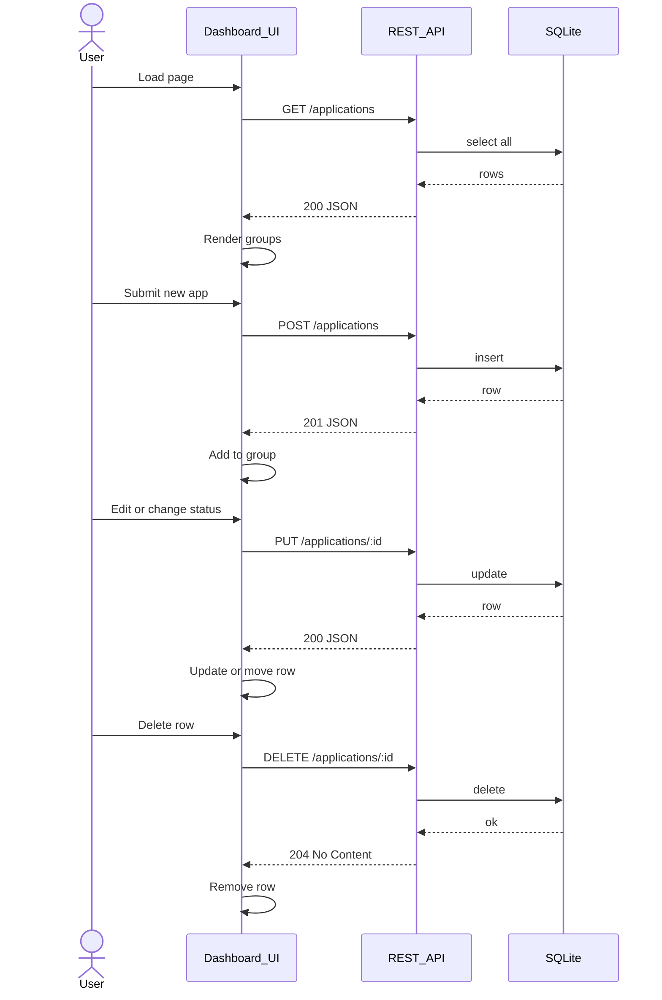

# Design: As a user, I want a single cohesive job application tracker to add, view, edit, delete, and change status of my applications via a REST API and a dashboard.

## Overview
Build a single-page dashboard backed by an Express REST API with a SQLite database. A single Applications table stores records. The frontend uses fetch to call the API and updates the DOM without full reloads. Server validates inputs, applies defaults, and returns JSON with correct status codes.

## Components
- db.js: Initialize SQLite (file: data/applications.db), run migrations, expose query helpers (prepared statements).
- applicationRepository.js: CRUD on Applications table (create, findAll, findById, update, remove, filterByStatus).
- validators.js: Validate status enum, date format YYYY-MM-DD, required fields; coerce defaults.
- applicationsController.js: Map HTTP to repository, apply validation, defaults, error mapping.
- routes/applications.js: Express Router wiring endpoints to controller.
- server.js: Express app, JSON middleware, static serving of /public, mount /applications routes.
- public/index.html: Dashboard layout with groups and form.
- public/app.js: Fetch API calls, render groups, inline edit/modal, status control, optimistic UI with error rollback.
- public/styles.css: Minimal styling.

## Data Flow
1. Server start:
   - db.js ensures table exists.
   - server.js serves static files and API.

2. GET /applications[?status=s]:
   - validators parses optional status.
   - repository returns all or filtered records sorted by applied_date desc.
   - controller returns 200 JSON array.

3. POST /applications:
   - validators require company, role; if status missing set applied; if applied_date missing set today (UTC, YYYY-MM-DD); validate status/date.
   - repository inserts and returns record.
   - controller returns 201 JSON.

4. GET /applications/:id:
   - repository fetch by id; 404 if not found.
   - controller returns 200 JSON.

5. PUT /applications/:id:
   - validators check provided fields only; validate status/date; reject empty payload with 400.
   - repository updates; 404 if no row.
   - controller returns 200 JSON.

6. DELETE /applications/:id:
   - repository deletes; 404 if not found.
   - controller returns 204.

7. Dashboard:
   - On load, app.js GETs /applications, groups by status, renders.
   - Add form submits POST; on 201, insert row into group.
   - Edit and Status change send PUT; on 200, update row and move groups if status changed.
   - Delete sends DELETE; on 204, remove row.

## Diagram

## Key Decisions
- Decision: Status enum fixed set — Rationale: Enforce data consistency and filtering.
- Decision: ISO date YYYY-MM-DD UTC — Rationale: Predictable client/server behavior.
- Decision: Serve dashboard from same origin — Rationale: Avoid CORS complexity.

## Edge Cases & Risks
- Invalid status/date: return 400 with message.
- Missing company/role on POST: 400.
- Empty PUT body: 400.
- Nonexistent id on GET/PUT/DELETE: 404.
- SQL injection: use prepared statements.
- XSS via notes: escape on render, set textContent.
- Timezone drift: compute applied_date in UTC.
- Concurrent edits: last write wins; return updated record.

## Acceptance Criteria (Technical)
- [ ] All REST endpoints behave per spec with codes and JSON.
- [ ] Default status and applied_date applied on POST when omitted.
- [ ] GET supports status filter accurately.
- [ ] Dashboard groups and updates without full reload.
- [ ] Inline edit, delete, and status change persist to API.
- [ ] Basic input validation and error handling in UI and API.