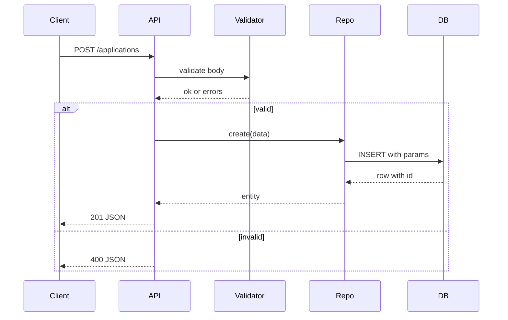

# Design: As a user, I want my tracker to ensure data integrity and reliable persistence so my applications are stored correctly and validations are enforced.

## Overview
Implement a SQLite-backed persistence layer with DB-level constraints and defaults, a REST API with strict validation, parameterized SQL, and consistent ISO-8601 date storage. The DB enforces allowed status and non-empty required fields; the API returns JSON responses, detailed 400 errors, and 404/204 where applicable. An optional index on status supports filtered reads.

## Components
- SchemaManager
  - Creates table and index.
  - SQL: CREATE TABLE applications(id INTEGER PRIMARY KEY AUTOINCREMENT, company TEXT NOT NULL CHECK(trim(company) <> ''), role TEXT NOT NULL CHECK(trim(role) <> ''), status TEXT NOT NULL DEFAULT 'applied' CHECK(status IN ('applied','interviewing','offer','rejected')), applied_date TEXT NOT NULL DEFAULT (date('now')) CHECK(applied_date GLOB '____-__-__'), notes TEXT);
  - Optional: CREATE INDEX IF NOT EXISTS idx_applications_status ON applications(status);
- SQLiteClient
  - Opens DB, runs prepared statements, maps rows to JSON.
- ApplicationRepo
  - Methods: create(data), list(filter), getById(id), update(id,data), delete(id).
  - Uses parameterized SQL only.
- ApplicationValidator
  - Validates POST/PUT body: non-empty company/role, enum status, applied_date format YYYY-MM-DD.
- ApplicationsController
  - Routes: POST /applications, GET /applications, GET /applications/:id, PUT /applications/:id, DELETE /applications/:id.
  - Applies validation, maps errors to JSON.
- ErrorMiddleware
  - Uniform JSON error shape { error, details } and 400/404/500 codes.
- DateUtil
  - ISO date regex and parsing.

## Data Flow
1) Request hits ApplicationsController.
2) Parse JSON body (POST/PUT) and params.
3) ApplicationValidator checks fields; on fail return 400 JSON details.
4) Controller calls ApplicationRepo with validated data.
5) Repo executes prepared SQL:
   - INSERT excludes status/applied_date to use DB defaults when not provided.
   - UPDATE sets provided fields; verify rowcount.
6) For GET/PUT/DELETE by id: if no row, return 404 JSON.
7) On success: return JSON body (201 for create, 200 for read/update); DELETE returns 204 no body.

## Diagram

## Key Decisions
- Decision: Enforce constraints in DB — Rationale: Defense in depth beyond API validation.
- Decision: Use DB defaults for status and applied_date — Rationale: Reliable server-side defaults.
- Decision: Parameterized SQL only — Rationale: Prevent SQL injection.
- Decision: 204 on delete — Rationale: RESTful semantics.
- Decision: Optional status index — Rationale: Optimize filtered queries.

## Edge Cases & Risks
- Whitespace-only company/role: trim and reject with 400.
- applied_date provided but invalid: 400; DB CHECK also guards.
- Client sends extra fields: ignore or 400; prefer reject unknowns to avoid silent errors.
- Timezone: date('now') is UTC; document behavior.
- Migration failures: fail fast and log; app should not start without schema.
- Concurrency: rely on SQLite transactions; wrap write ops in BEGIN/COMMIT.

## Acceptance Criteria (Technical)
- [ ] Schema created with constraints, defaults, and optional status index.
- [ ] API validates inputs and returns 400 JSON with field errors.
- [ ] POST uses DB defaults when fields omitted; dates stored as YYYY-MM-DD.
- [ ] GET/PUT/DELETE by id return 404 JSON when missing; DELETE returns 204.
- [ ] All SQL uses prepared statements with parameters.