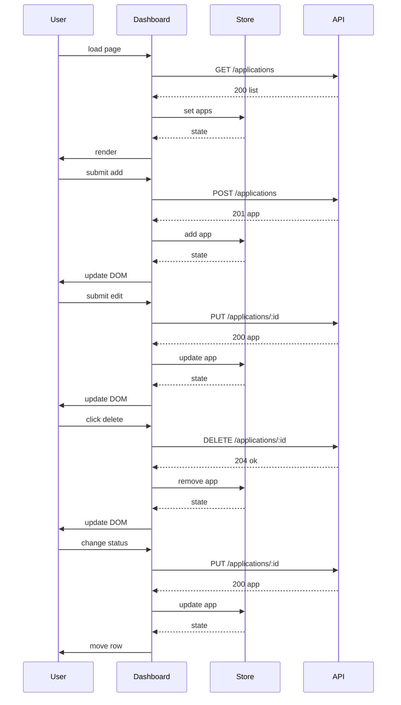

# Design: As a user, I want a single-page dashboard to add, view, edit, delete, and change the status of my job applications, grouped by status.

## Overview
A single HTML page renders a dashboard with four status columns. Vanilla JS modules manage state and DOM updates. A small store caches applications and notifies the UI on changes. All CRUD actions call the provided REST API via fetch. After each action, the store updates and re-renders affected rows/columns without a full page reload.

## Components
- index.html: Static single page with root nodes for columns and modals.
- index.js: Bootstraps app, binds events, triggers initial load.
- api_client.js:
  - getApplications(status?)
  - getApplication(id)
  - createApplication({company, role, notes})
  - updateApplication(id, patch)
  - deleteApplication(id)
- store.js:
  - State: Map<id, Application>
  - Methods: loadAll, add, update, remove, byStatus(status), subscribe(cb)
- dashboard_view.js:
  - Render columns for applied, interviewing, offer, rejected
  - Diff and patch DOM by id
- row_view.js:
  - Render row with Edit, Delete, Status selector
  - Event delegation for actions
- form_modal.js:
  - Show/hide create/edit form, validate inputs, emit submit
- notifications.js:
  - Toasts for success/error
- constants.js:
  - STATUSES = ["applied","interviewing","offer","rejected"]

## Data Flow
1) Initial load:
- index.js calls api_client.getApplications()
- store.loadAll(data), dashboard_view.render(store.byStatus)
2) Add:
- User submits form; defaults applied and today
- api_client.createApplication(payload) -> store.add(new)
- dashboard_view inserts row in applied
3) Edit:
- Open modal with cached data (fallback to getApplication(id) if missing)
- api_client.updateApplication(id, patch) -> store.update(updated)
- dashboard_view updates row; move column if status changed
4) Delete:
- Confirm; api_client.deleteApplication(id)
- store.remove(id); dashboard_view removes row
5) Change status:
- Row status select change
- api_client.updateApplication(id, {status}) -> store.update(updated)
- dashboard_view moves row between columns

## Diagram

## Key Decisions
- Decision: Vanilla JS modules — Rationale: Meets single-page requirement without framework overhead.
- Decision: Pessimistic updates — Rationale: Update UI after server success to avoid divergence.
- Decision: Client-side grouping — Rationale: One GET for all, simpler rendering; status filter optional unused.

## Edge Cases & Risks
- API errors: Show toast; revert UI; keep modal open.
- Slow network: Disable buttons with spinner to prevent double submits.
- Invalid inputs: Client validation (company, role required).
- Timezone for applied_date: Use client local date; server may override.
- Concurrent edits: Always trust response body to refresh row.

## Acceptance Criteria (Technical)
- [ ] GET /applications on load; render grouped by status.
- [ ] Create sets default status and today; POST /applications used.
- [ ] Edit uses PUT /applications/:id; row updates and moves if status changes.
- [ ] Delete uses DELETE /applications/:id; row removed.
- [ ] Status change uses PUT /applications/:id; row moves columns.
- [ ] No full page reload; DOM patches after each action.