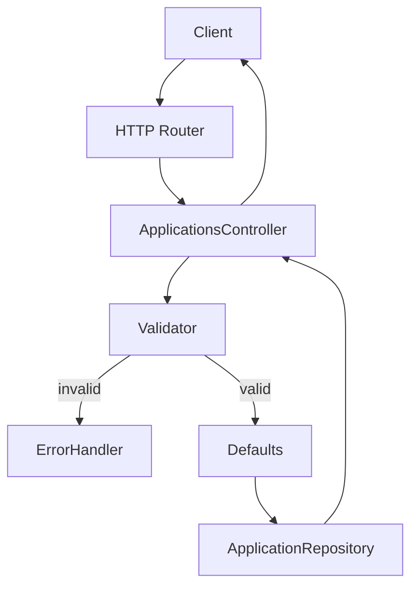

# Design: As a user, I want the system to enforce required fields, valid statuses, and sensible defaults so my application data remains consistent.

## Overview
Introduce a validation and defaults pipeline in the applications API. All writes pass through a validator that trims strings, enforces required fields and status enum, then applies sensible defaults on create. A repository abstraction persists and queries records. A centralized error handler returns consistent JSON errors.

## Components
- ApplicationsController: HTTP handlers for POST/GET/PUT/DELETE.
- ApplicationService: Orchestrates validation, defaults, repo operations.
- Validator: validateRequiredCompanyRole, validateStatus, validateId.
- Defaults: applyCreateDefaults (status, applied_date).
- Status enum: ["applied","interviewing","offer","rejected"].
- ApplicationRepository: create, getById, update, delete, listByStatus.
- DateUtil: todayUtcYmd() -> "YYYY-MM-DD".
- ErrorHandler: Map domain errors to {message} and HTTP codes.
- IdGenerator: generate UUID v4 (or DB auto id).

## Data Flow
- POST /applications:
  1) Controller parses JSON body; trims strings.
  2) Validator: company and role non-empty, status (if present) in enum.
  3) Defaults: if status missing set "applied"; if applied_date missing set todayUtcYmd.
  4) Repo.create returns record with id; respond 201 JSON.

- GET /applications?status=:
  1) If status param present: validate against enum; else list all.
  2) Repo.listByStatus or listAll; respond 200 JSON.

- GET /applications/:id:
  1) Validator: id format.
  2) Repo.getById; if not found -> 404; else 200 JSON.

- PUT /applications/:id:
  1) Parse JSON; trims strings.
  2) Validator: id exists (repo lookup) else 404; validate provided fields only: company/role if present non-empty; status if present in enum; applied_date if present is YYYY-MM-DD.
  3) Repo.update merges provided fields; respond 200 JSON.

- DELETE /applications/:id:
  1) Validator: id format.
  2) Repo.delete; if not found -> 404; else 204 no body.

## Diagram

## Key Decisions
- Decision: Trim and lowercase status — Rationale: Prevent trivial input errors; store canonical lowercase.
- Decision: Defaults only on POST — Rationale: Avoid unintended changes during updates.
- Decision: Use UTC for dates — Rationale: Consistent applied_date irrespective of server TZ.
- Decision: JSON errors {message} only — Rationale: Matches acceptance and simplifies clients.

## Edge Cases & Risks
- Whitespace-only company/role: trim then reject 400.
- Unknown query params ignored; unknown body fields ignored.
- Invalid date format on PUT: 400 with message.
- Case variants of status: normalize to lowercase, validate.
- Timezone drift: DateUtil uses UTC midnight.
- Concurrency on delete/update: repo methods are idempotent; DELETE of missing returns 404.

## Acceptance Criteria (Technical)
- [ ] POST with missing company or role returns 400 JSON {message}.
- [ ] POST without status defaults to "applied".
- [ ] POST without applied_date defaults to today in YYYY-MM-DD (UTC).
- [ ] POST with invalid status returns 400 JSON.
- [ ] GET /applications?status=applied filters correctly; invalid status returns 400.
- [ ] GET /applications/:id non-existent returns 404 JSON.
- [ ] PUT /applications/:id non-existent returns 404 JSON; valid updates return 200 JSON.
- [ ] DELETE /applications/:id returns 204 and record is removed.