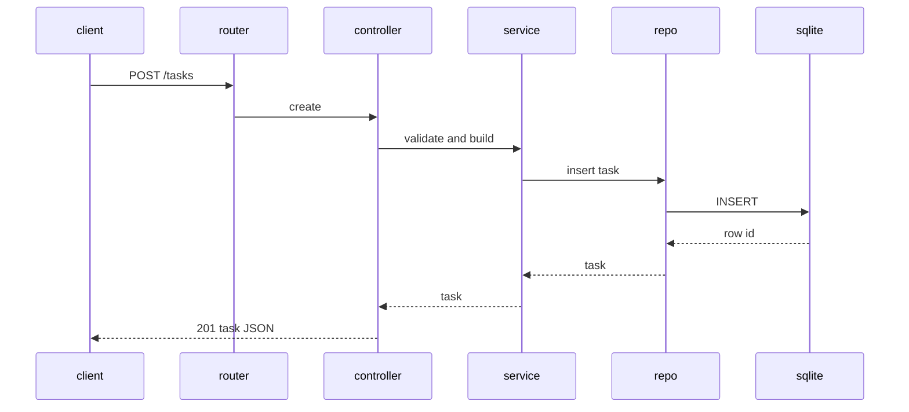

# Design: As a user, I want to manage tasks via a REST API so I can create, list, retrieve, update, and delete tasks

## Overview
Implement a RESTful API backed by SQLite with a thin controller-service-repository stack. Validate inputs, enforce defaults, and return JSON with correct HTTP codes. Data model: Task(id, title, description, status, created_date). Use prepared statements, simple migrations, and centralized error handling.

## Components
- Router: Maps routes to TaskController methods.
- TaskController:
  - create(req): POST /tasks
  - list(req): GET /tasks
  - get(req): GET /tasks/{id}
  - update(req): PUT/PATCH /tasks/{id}
  - delete(req): DELETE /tasks/{id}
- TaskService:
  - validateCreate(dto), validateUpdate(dto)
  - createTask(dto), listTasks(filter), getTask(id), updateTask(id, dto), deleteTask(id)
- TaskRepository (SQLite):
  - insert(task), findAll(status?), findById(id), update(id, fields), delete(id)
- DB (SQLite):
  - Connection pool, migrations runner.
- Models/DTOs:
  - Task: {id, title, description, status, created_date}
  - CreateTaskDTO: {title, description?}
  - UpdateTaskDTO: {title?, description?, status?}
- ErrorMiddleware: Maps thrown errors to JSON {error: "..."} and status codes.
- Validation:
  - title: non-empty after trim
  - status: in {todo, doing, done}
  - id: positive integer
- Migration V1:
  - CREATE TABLE tasks(id INTEGER PRIMARY KEY AUTOINCREMENT, title TEXT NOT NULL, description TEXT, status TEXT NOT NULL DEFAULT 'todo' CHECK(status IN ('todo','doing','done')), created_date TEXT NOT NULL)

## Data Flow
- Create:
  1) Controller parses JSON, trims fields, validates.
  2) Service sets status="todo", created_date=UTC YYYY-MM-DD.
  3) Repo inserts, returns row with id.
  4) Controller returns 201 with task JSON.
- List:
  1) Controller reads optional status, validates if present.
  2) Repo fetches all or filtered.
  3) Return 200 with array.
- Retrieve:
  1) Validate id.
  2) Repo findById; 404 if null; else 200 with task.
- Update (PUT/PATCH):
  1) Validate id and payload fields; reject unknown fields.
  2) Repo update only provided fields; 404 if no row.
  3) Repo re-fetch; return 200 with task.
- Delete:
  1) Validate id.
  2) Repo delete; return 204 if deleted; 404 otherwise.

## Diagram

## Key Decisions
- Default status on create is forced to "todo" regardless of input — matches acceptance.
- created_date stored as UTC YYYY-MM-DD TEXT — simple filtering and portability.
- Accept both PUT and PATCH; both perform partial updates — simpler client use.
- Unknown fields in bodies cause 400 — prevents silent typos.
- Prepared statements only — mitigate SQL injection.

## Edge Cases & Risks
- Empty or whitespace title: 400 with {error}.
- Invalid JSON: 400.
- Invalid id (non-integer): 400.
- Invalid status or filter value: 400.
- Not found id: 404.
- DB errors: 500 with generic error; no internals leaked.
- Large lists: no pagination now; monitor for growth.

## Acceptance Criteria (Technical)
- [ ] POST /tasks with valid title returns 201 and JSON with id, title, description, status "todo", created_date today (UTC).
- [ ] PUT/PATCH /tasks/{id} with invalid status returns 400; with valid fields updates and returns 200; GET/DELETE handle 404 for missing ids; GET /tasks?status filters correctly.