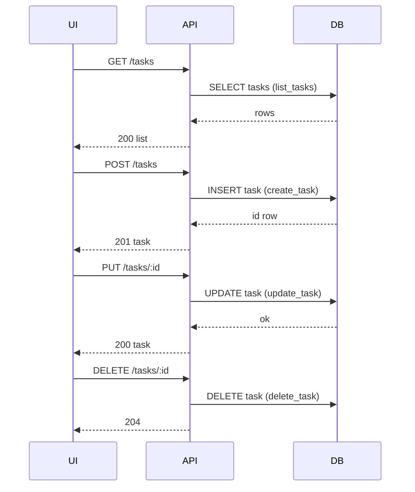

# Design: As a user, I want to create, view, update, and delete tasks via a REST API and a single-page dashboard so that I can manage my work items end-to-end.

## Overview
Implement a small Python module that encapsulates task persistence and validation using SQLite, and provides a generated single-page dashboard HTML. The module exposes pure functions for CRUD over a tasks table with strict status validation. The dashboard uses vanilla JS fetch to load, render grouped lists, and trigger API calls; UI updates only after successful responses.

Note: An HTTP web layer is expected to expose REST endpoints that map to the provided functions and serve the generated HTML. That web layer is not implemented in this module.

## Components
- scrum_77.py:
  - SQLite plumbing: open connection with row factory, ensure schema with CHECK constraint and default created_date.
  - Business functions (repository + validation combined):
    - create_task(title, description?, status?) -> task dict
    - get_task(id) -> task dict or None
    - list_tasks(status?) -> list[task dict]
    - update_task(id, title?, description?, status?) -> task dict
    - delete_task(id) -> bool
    - validate_status(status) -> raises on invalid
  - HTML generator:
    - get_dashboard_html() -> string of a minimal SPA with three columns and an add form; includes embedded JS that calls REST endpoints.

- Web layer (not included in this module, to be provided by integrator):
  - Exposes REST endpoints that map to the above functions and serves the HTML returned by get_dashboard_html().
  - Translates Python exceptions/None returns to appropriate HTTP status codes.

## Data Flow
1. Initial load:
   - UI (from get_dashboard_html) calls GET /tasks.
   - Web layer maps to list_tasks(), returns JSON.
   - UI groups by status and renders columns.

2. Create:
   - User submits form; UI calls POST /tasks with {title, description?}.
   - Web layer validates via create_task(); returns 201 with created task on success.
   - UI clears form and reloads/rerenders after the response.

3. Update status (or other fields):
   - User changes status select; UI calls PUT /tasks/:id with {status}.
   - Web layer calls update_task(); returns 200 with updated task.
   - UI reloads and rerenders on success.

4. Delete:
   - User clicks delete; UI calls DELETE /tasks/:id.
   - Web layer calls delete_task(); returns 204 on success.
   - UI reloads and rerenders.

5. Filter API:
   - UI may call GET /tasks?status=doing.
   - Web layer validates via list_tasks(status='doing') and returns only matching tasks.

## Diagram

## Key Decisions
- Decision: Python + sqlite3 — Rationale: Minimal deps, standard library DB driver; straightforward SQL with parameterized statements.
- Decision: Generated SPA HTML from backend function — Rationale: Keep distribution simple; no separate static asset pipeline.
- Decision: Serve SPA from same origin (via web layer) — Rationale: Avoid CORS complexity.
- Decision: Status enum with CHECK — Rationale: Enforce integrity at DB and app layers.
- Decision: created_date default UTC — Rationale: Consistent timestamps via datetime('now').

## Edge Cases & Risks
- Invalid status or missing title:
  - create_task: raises ValueError on invalid inputs.
  - update_task: raises ValueError on invalid status or empty title.
  - Web layer should translate ValueError to 400 with message.
- Not found id on GET/PUT/DELETE:
  - get_task: returns None.
  - update_task: raises KeyError when id not found.
  - delete_task: returns False when nothing deleted.
  - Web layer should translate to 404.
- Concurrent writes: SQLite handles serialization; keep operations short.
- XSS: Dashboard uses textContent-based escaping before rendering.
- SQL injection: Use parameterized statements only.
- Large lists: Basic rendering; consider pagination later.

## Acceptance Criteria (Technical)
- [ ] SQLite table created with id PK, title, description, status enum, created_date default.
- [ ] create_task inserts a row, returns the created task dict.
- [ ] list_tasks lists all; list_tasks(status=) filters correctly; validate_status enforces allowed values.
- [ ] get_task(id) returns None when missing.
- [ ] update_task(id, ...) updates title/description/status with validation; raises KeyError if missing.
- [ ] delete_task(id) returns True when a row was removed, False otherwise.
- [ ] get_dashboard_html returns an SPA that loads tasks grouped by status and reflects create, update, delete after REST API responses from a web layer that maps to these functions.