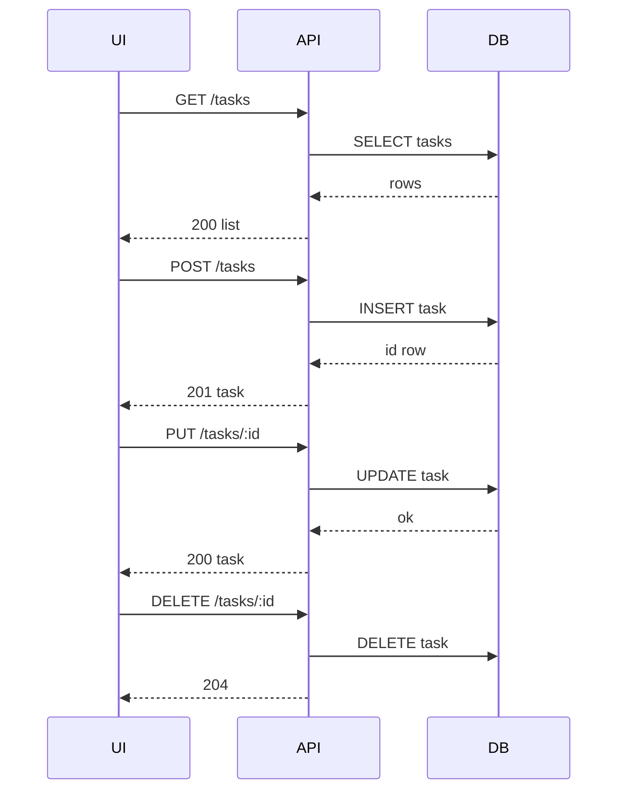

# Design: As a user, I want to create, view, update, and delete tasks via a REST API and a single-page dashboard so that I can manage my work items end-to-end.

## Overview
Build a small Express.js server with SQLite for persistence and a static single-page dashboard. The server exposes REST endpoints for CRUD over a tasks table with strict status validation. The dashboard uses vanilla JS fetch to load, render grouped lists, and trigger API calls; UI updates only after successful responses.

## Components
- server.js: Express app, JSON middleware, static file serving, routes registration, error handler.
- db.js: Initialize SQLite (better-sqlite3), run CREATE TABLE IF NOT EXISTS with constraints.
- tasks.repository.js: SQL operations using prepared statements: create, getById, list(filter), update, remove.
- tasks.validator.js: Validate payloads (title required on create, optional on update; status in todo|doing|done).
- tasks.controller.js: Express handlers mapping endpoints to repository, translate errors to HTTP codes.
- public/index.html: Minimal SPA shell with three columns and an add form.
- public/app.js: DOM rendering, event handlers, optimistic disabling, calls api.js, re-renders after responses.
- public/api.js: Wrapper functions for fetch calls to REST endpoints.

## Data Flow
1. Initial load: app.js calls GET /tasks, groups by status, renders columns.
2. Create: User submits form; api.postTask sends POST /tasks; server validates, inserts row, returns 201 with task; UI appends task in correct column and clears form.
3. Update status: User changes a select; api.updateTask sends PUT /tasks/:id with new status; server validates and updates; UI moves card on 200.
4. Delete: User clicks delete; api.deleteTask sends DELETE /tasks/:id; on 204 UI removes card.
5. Filter API: GET /tasks?status=doing returns only matching tasks; controller adds WHERE status = ? if provided.

## Diagram

## Key Decisions
- Decision: Express + better-sqlite3 — Rationale: Minimal deps, simple sync SQL with prepared statements.
- Decision: Serve SPA from same origin — Rationale: Avoid CORS complexity.
- Decision: Status enum with CHECK — Rationale: Enforce integrity at DB and app layers.
- Decision: created_date default UTC — Rationale: Consistent timestamps via datetime('now').

## Edge Cases & Risks
- Invalid status or missing title: return 400 with message.
- Not found id on GET/PUT/DELETE: return 404.
- Concurrent writes: better-sqlite3 serialized; keep operations short.
- XSS: Escape text content when rendering.
- SQL injection: Use parameterized statements only.
- Large lists: Basic rendering; consider pagination later.

## Acceptance Criteria (Technical)
- [ ] SQLite table created with id PK, title, description, status enum, created_date default.
- [ ] POST /tasks creates task, returns 201 with body.
- [ ] GET /tasks lists all; GET /tasks?status= filters correctly.
- [ ] GET /tasks/:id returns 404 when missing.
- [ ] PUT /tasks/:id updates title/description/status with validation.
- [ ] DELETE /tasks/:id returns 204 and removes row.
- [ ] Dashboard loads tasks grouped by status and reflects create, update, delete after API responses.