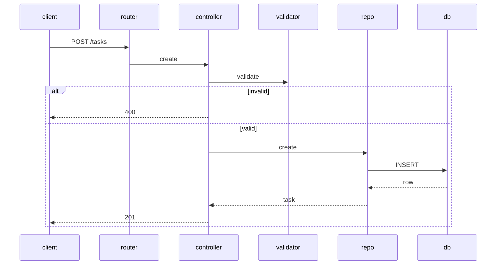

# Design: As a user, I want the system to enforce valid task data and sensible defaults so that my tasks are consistent and reliable.

## Overview
We will enforce validation in both the API layer and at the SQLite schema level. The server will validate title and status and apply sensible defaults on create. The database will enforce CHECK constraints and defaults to guarantee integrity even if inputs bypass the API. Not-found and invalid-input errors are consistently mapped to HTTP status codes.

## Components
- Migration: creates tasks table with constraints and defaults; adds index on status.
- TaskRepository: CRUD and list with optional status filter; maps DB rows to Task DTO.
  - create(data), get(id), update(id, data), delete(id), list(filter)
- TaskValidator: validate and normalize inputs.
  - validateCreate(payload) -> {title, status?}
  - validateUpdate(payload) -> {title?, status?}
  - validateStatusFilter(qs) -> {status?}
- TaskController: HTTP handlers for /tasks and /tasks/:id; applies defaults; maps errors.
- ErrorMapper: converts domain errors to HTTP 400/404.
- Router: routes HTTP methods to TaskController.

## Data Flow
- POST /tasks
  1) Router -> Controller
  2) Controller -> Validator.validateCreate
  3) Apply defaults: status = 'todo' if missing; ignore client created_date
  4) Repository.create inserts; DB sets created_date; DB enforces CHECK/DEFAULT
  5) Return 201 with created task
- GET /tasks?status=...
  1) Controller -> Validator.validateStatusFilter; reject invalid status with 400
  2) Repository.list(filter) -> DB SELECT with WHERE status=?
  3) Return 200 with tasks
- GET /tasks/:id
  1) Repository.get(id)
  2) If null -> 404; else 200
- PUT /tasks/:id
  1) Controller -> Validator.validateUpdate
  2) Repository.get(id); if null -> 404
  3) Repository.update(id, data); DB CHECK enforces status/title
  4) Return 200 with updated task
- DELETE /tasks/:id
  1) Repository.delete(id) returns affected rows
  2) If 0 -> 404; else 204

## Diagram

## Key Decisions
- Decision: Validate in app and DB — Rationale: defense in depth and consistent errors.
- Decision: DB default for status and created_date — Rationale: guarantees even if API missed.
- Decision: Ignore client created_date — Rationale: server-authoritative timestamps.

## Edge Cases & Risks
- Title with only whitespace: trim and reject (length > 0).
- Invalid status in query: return 400.
- Non-integer id path: return 400 before DB call.
- Timezone: created_date uses SQLite date('now') in UTC (YYYY-MM-DD).
- SQLite CHECK relies on trim: ensure SQLite version supports trim.

## Acceptance Criteria (Technical)
- [ ] POST without status sets status=todo; created_date stored as today.
- [ ] Empty or whitespace title on create/update returns 400.
- [ ] Invalid status on create/update/filter returns 400.
- [ ] GET/PUT/DELETE /tasks/:id on missing id returns 404.
- [ ] DB schema enforces CHECK on status and title; DEFAULTs for status and created_date.

Schema (SQLite):
CREATE TABLE tasks (
  id INTEGER PRIMARY KEY,
  title TEXT NOT NULL CHECK(length(trim(title)) > 0),
  status TEXT NOT NULL DEFAULT 'todo' CHECK(status IN ('todo','doing','done')),
  created_date TEXT NOT NULL DEFAULT (date('now'))
);
CREATE INDEX idx_tasks_status ON tasks(status);