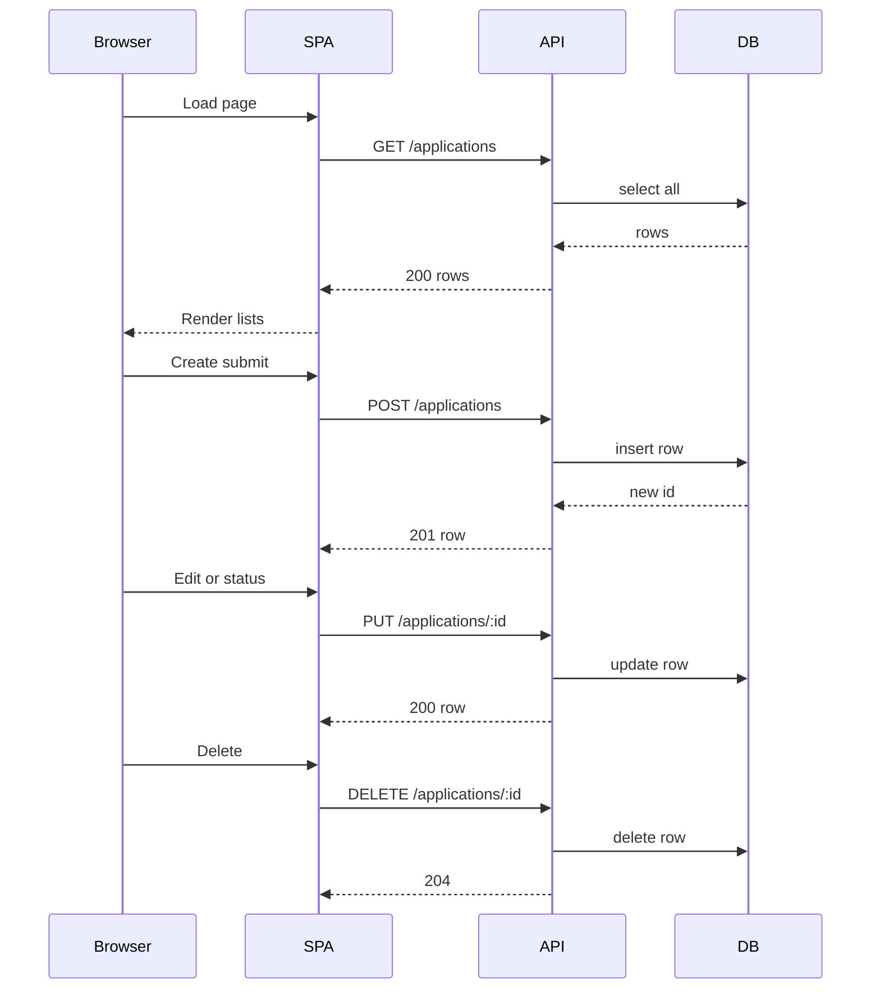

# Design: As a user, I want a unified job application tracker with a REST API and a single-page dashboard so I can manage my applications end-to-end.

## Overview
Build a SQLite-backed REST API exposing CRUD over a single table, and a static single-page app that consumes the API to list, create, edit, delete, and change status of applications. The UI groups applications by status and updates optimistically with server confirmation.

## Components
- Backend
  - server.ts: Express app, route wiring, JSON body parsing, CORS, error middleware.
  - db.ts: SQLite init (better-sqlite3), migration creating table if missing, indices on status and applied_date.
  - application_repo.ts: CRUD functions (create, findAll, findByStatus, findById, update, delete).
  - validators.ts: Validate payload fields, status enum, ISO date, string lengths.
  - controllers.ts: Route handlers mapping to endpoints, calling repo, returning 2xx/4xx/5xx.
- Frontend
  - index.html: Containers for four status columns, form modal for create/edit.
  - api.js: fetch wrappers for GET, POST, PUT, DELETE to /applications.
  - state.js: In-memory store of applications and helpers to group by status.
  - ui.js: Render grouped lists, build rows with edit, delete, status dropdown.
  - events.js: Wire UI events to API calls, optimistic updates with rollback on error.
  - main.js: Bootstraps load, initial fetch, attaches handlers.

## Data Flow
1. Page load:
   - main.js calls api.list() -> GET /applications.
   - state stores results; ui renders four columns grouped by status.
2. Create:
   - User submits form; validators run client-side; api.create() -> POST /applications.
   - On 201, state adds returned row; ui re-renders affected column.
3. Edit:
   - User edits a row; state merges changes; api.update(id, full payload) -> PUT /applications/:id.
   - On 200, state replaces row; on error, rollback and show toast.
4. Change status:
   - User selects new status; state updates; api.update() with full object including status.
   - UI moves row between columns.
5. Delete:
   - User clicks delete; api.remove(id) -> DELETE /applications/:id.
   - On 204, state removes; ui updates.
6. Filtering:
   - api.list({status}) -> GET /applications?status= to fetch subsets if needed.

## Diagram

## Key Decisions
- Decision: Node.js Express and better-sqlite3 — Rationale: Simple, fast SQLite access with minimal async complexity.
- Decision: Status enum enforced in DB — Rationale: Data integrity for grouping.
- Decision: ISO 8601 date string — Rationale: Cross-platform parsing and sorting.
- Decision: PUT requires full object — Rationale: Simpler server logic per spec.

## Edge Cases & Risks
- Invalid status or date: 400 with message; UI shows error and rolls back.
- Not found id: 404 on GET/PUT/DELETE.
- SQLite locking under load: use WAL mode and short transactions.
- XSS in notes: escape on render; use textContent.
- Large notes: limit length in validators.
- CORS: enable for SPA host.

## Acceptance Criteria (Technical)
- [ ] SQLite table created with id, company, role, status, applied_date, notes and status CHECK.
- [ ] Endpoints: POST, GET (all and ?status=), GET by id, PUT by id, DELETE by id return correct codes.
- [ ] SPA lists applications grouped by status and updates on CRUD.
- [ ] Status changes move rows and persist via PUT.
- [ ] Client and server validate inputs; errors displayed.
- [ ] All API changes persist to SQLite.