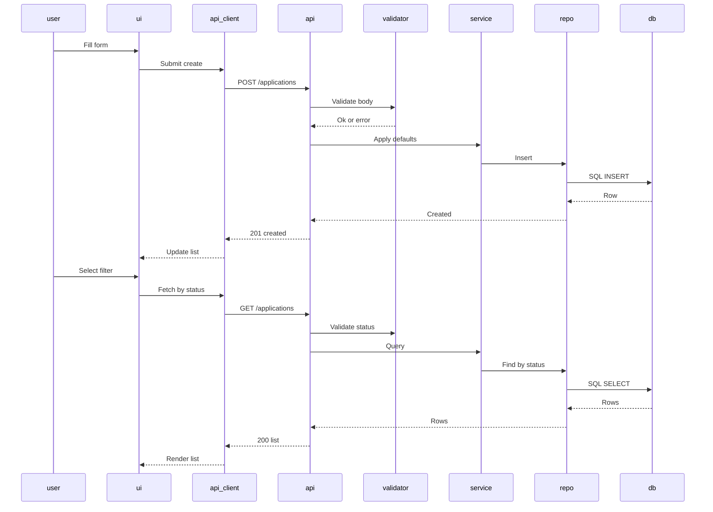

# Design: As a user, I want validation, sensible defaults, and filtering so my data stays clean and easy to browse.

## Overview
Implement server-side validation and defaults with DB-level safeguards, plus a SPA UI that performs inline validation and filter-driven querying. The API enforces allowed status values, trims input, applies defaults when fields are absent, and returns clear JSON errors with proper HTTP codes. The dashboard prevents invalid submissions and fetches filtered lists without page reload.

## Components
- db/schema.sql: applications table with constraints and defaults (status default 'applied', applied_date default CURRENT_DATE, CHECK on status).
- repository/ApplicationsRepository: CRUD using SQLite (insert, findAll, findByStatus).
- services/ApplicationsService: Business rules (trim, normalize, defaults, date parsing).
- http/validators/ApplicationValidator: Validate company, role non-empty; status in enum; applied_date format YYYY-MM-DD if provided.
- http/ApplicationsController: Routes POST /applications, GET /applications; maps errors to HTTP JSON.
- http/ErrorMiddleware: Standardize error responses {code, message, fields}.
- frontend/ApiClient: GET/POST helpers with error parsing.
- frontend/components/ApplicationForm: Inline validation, disable submit on errors, shows field messages.
- frontend/components/FilterBar: Status dropdown (all, applied, interviewing, offer, rejected).
- frontend/components/ApplicationList: Renders applications.
- frontend/state/Store: Holds applications and active status filter.

## Data Flow
1) Create application
- User enters form in ApplicationForm.
- Client validates required fields; disables submit on error.
- On submit, ApiClient POST /applications with company, role, status?, applied_date?.
- Controller calls Validator; on pass, Service trims, lowercases status, applies defaults if missing, validates date, then calls Repository.insert.
- Repository inserts to SQLite; DB defaults/checks backstop integrity.
- Controller returns 201 with created record; UI refreshes list state.

2) Filter list
- User selects status in FilterBar.
- Store updates active filter; ApiClient GET /applications?status=applied (omitted for all).
- Controller validates status if present; Service queries via Repository (WHERE status = ?).
- Controller returns 200 with list; List renders without page reload.

## Diagram

## Key Decisions
- Decision: Validate and default in service and validator — Rationale: Centralizes logic, keeps controller thin.
- Decision: DB CHECK and DEFAULT — Rationale: Enforce integrity even if service is bypassed.
- Decision: Normalize status to lowercase and trim strings — Rationale: Consistent storage and filtering.
- Decision: Date format YYYY-MM-DD (UTC) — Rationale: Predictable comparisons and display.

## Edge Cases & Risks
- Empty strings or whitespace-only: Trim then validate non-empty.
- Invalid status or casing: Lowercase then validate; 400 on invalid.
- applied_date invalid: 400 with field-specific error; if missing, default to CURRENT_DATE.
- Client sends nulls: Treat as missing; apply defaults or error.
- Timezone drift: Use server UTC date; display in local on UI if needed.

## Acceptance Criteria (Technical)
- [ ] POST without status and applied_date returns 201 with status=applied and applied_date=today (UTC).
- [ ] POST with empty company or role returns 400 and JSON errors per field; DB not mutated.
- [ ] POST with invalid status returns 400 with message and allowed values.
- [ ] GET /applications?status=applied returns only applied records; invalid status returns 400.
- [ ] UI blocks submit on client-side invalid state and shows inline messages; changing filter updates list without page reload.