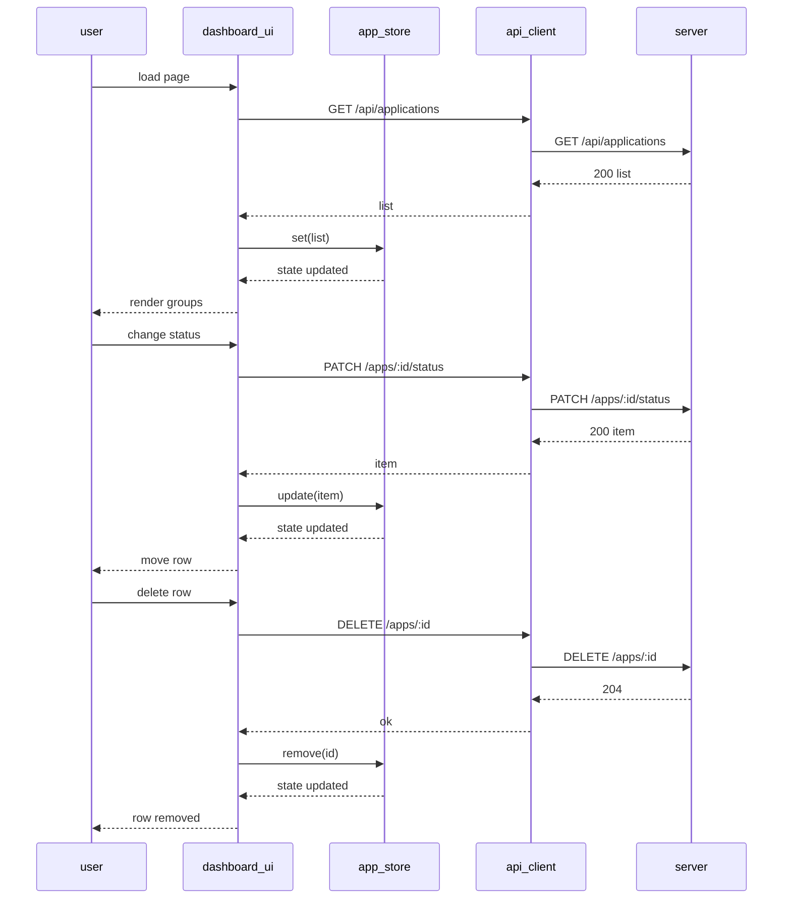

# Design: As a user, I want a single-page dashboard to view applications grouped by status and add/edit/delete or change status directly from the list.

## Overview
A single HTML page renders a dashboard grouped by status (Applied, Interviewing, Offer, Rejected). Vanilla JS modules manage state, render sections, and call the REST API with fetch. Updates are pessimistic (wait for API success before mutating state/UI), with inline editing and status dropdowns. Client-side validation ensures required fields and valid status; errors surface via a notification bar.

## Components
- api.js
  - ApiClient: getAll, create, update, updateStatus, remove; JSON handling, error mapping.
- store.js
  - AppStore: in-memory state {byId, order}, derived groups by status, subscribe/notify.
- ui/dashboard.js
  - DashboardView: bootstrap, load state, render groups, wire global events, loading/empty states.
- ui/group_list.js
  - GroupList: render a group section, keyed rows, empty-state per group.
- ui/row.js
  - RowView: render row, inline edit toggling, bind Edit/Delete/Status events.
- ui/add_form.js
  - AddForm: render form, validate, submit via ApiClient, reset on success.
- validation.js
  - validateApplication, validateStatus, sanitizeText.
- notifications.js
  - notifySuccess, notifyError, showLoading, clear.
- utils/date.js
  - todayISO, toISO, toDisplay.

Data model (DTO): Application { id:number, company:string, role:string, status:'applied'|'interviewing'|'offer'|'rejected', applied_date:ISO string (YYYY-MM-DD), notes?:string }

## Data Flow
1. Page load:
   - DashboardView.init() -> showLoading
   - ApiClient.getAll() GET /api/applications
   - On success: AppStore.set(list) -> notify -> render groups; on error: notifyError, show retry.
2. Add application:
   - AddForm.submit -> validate -> ApiClient.create() POST /api/applications
   - On success: AppStore.add(item) -> re-render affected group; on error: notifyError.
3. Edit inline:
   - RowView.switchToEdit -> user edits -> validate -> ApiClient.update(id, body) PUT /api/applications/:id
   - On success: AppStore.update(item) -> row updates and possibly moves group; on error: notifyError and keep edit mode.
4. Change status:
   - RowView.onStatusChange -> validateStatus -> ApiClient.updateStatus(id, {status}) PATCH /api/applications/:id/status
   - On success: AppStore.update(item) -> move row; on error: revert dropdown and notifyError.
5. Delete:
   - RowView.onDelete -> confirm -> ApiClient.remove(id) DELETE /api/applications/:id
   - On success: AppStore.remove(id) -> remove row; on error: notifyError.

## Diagram

## Key Decisions
- Inline edit form — Faster edits without modals; simpler focus management.
- Pessimistic updates — Avoids UI drift from failed API calls.
- Derived grouping in UI — Keep API simple; fetch all and group client-side.
- Status constants in client — Prevent invalid values before API call.
- ISO date strings — Consistent parsing and display.

## Edge Cases & Risks
- Network/API errors: show notification, keep UI state unchanged, provide retry on initial load.
- Invalid status or empty company/role: block submit, highlight fields, show message.
- Stale data after concurrent edits: rely on latest API response to overwrite local.
- Unknown status from API: place in “Other” group or hide and log.
- Slow calls: show spinners on row actions; disable buttons to prevent double submits.
- Timezone issues: treat applied_date as date-only (YYYY-MM-DD), no time.

## Acceptance Criteria (Technical)
- [ ] GET populates four groups with correct fields and per-row actions without full reload.
- [ ] Add/Edit/Delete/Status change call API, validate client-side, update or regroup rows on success, and show clear error messages on failure.