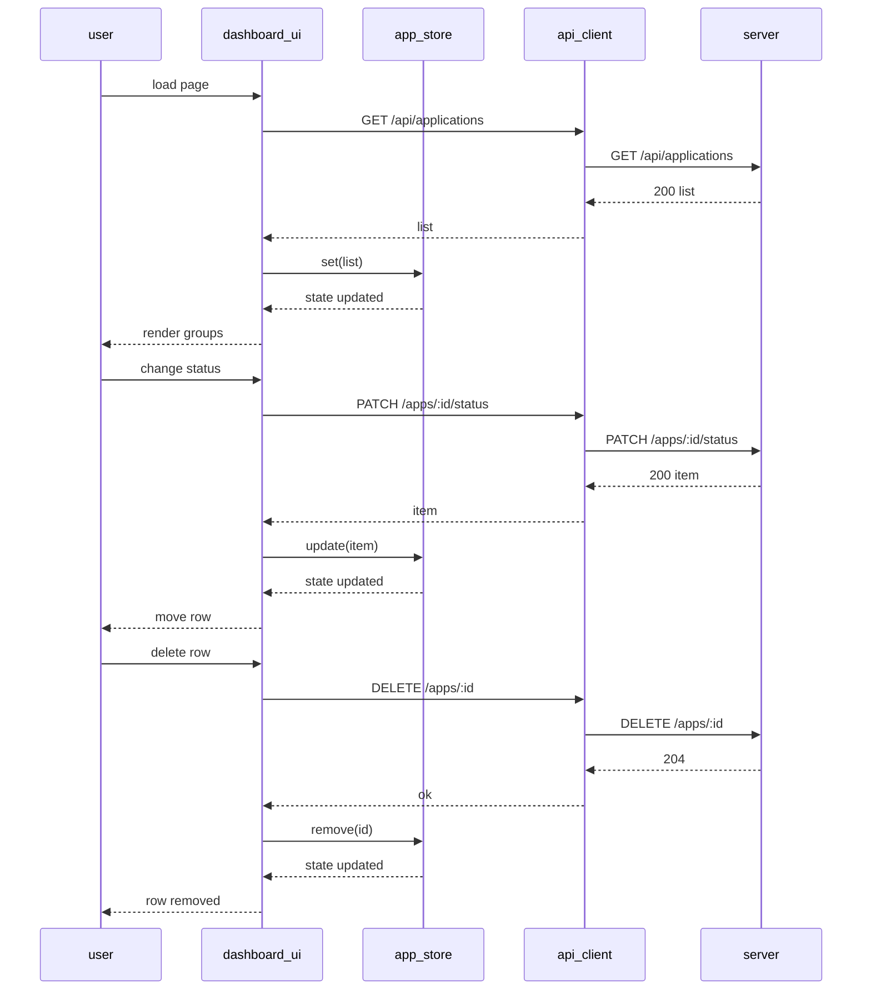

# Design: As a user, I want a single-page dashboard to view applications grouped by status and add/edit/delete or change status directly from the list.

## Overview
A single HTML page renders a dashboard grouped by status (Applied, Interviewing, Offer, Rejected). Vanilla JS modules manage state, render sections, and call the REST API with fetch. Updates are pessimistic (wait for API success before mutating state/UI), with inline editing and status dropdowns. Client-side validation performs basic required-field checks and sanitization; the server performs authoritative validation and normalization. Errors surface via a notification bar using messages returned by the server.

A Python service module provides business logic and persistence against SQLite. The REST layer wraps this module to expose endpoints consumed by the SPA.

## Components
- server/application_service.py (Python)
  - Responsibilities:
    - CRUD operations with SQLite persistence: list_applications, add_application, update_application, set_application_status, delete_application.
    - Validation and normalization: validate_status (case-insensitive, normalized to lowercase), validate_application_fields (required fields, ISO date format), sanitize_text.
    - Grouping helper: group_applications_by_status (used by server or UI; client continues to derive groups from list data).
    - Error mapping: error_to_message to convert exceptions into user-friendly strings for API responses.
    - Data model: Application DTO { id, company, role, status, applied_date, notes } persisted with additional internal fields (created_at, updated_at) not exposed to the client DTO.
- api.js
  - ApiClient: getAll, create, update, updateStatus, remove; JSON handling, maps server error messages to notifications.
- store.js
  - AppStore: in-memory state {byId, order}, derived groups by status, subscribe/notify.
- ui/dashboard.js
  - DashboardView: bootstrap, load state, render groups, wire global events, loading/empty states.
- ui/group_list.js
  - GroupList: render a group section, keyed rows, empty-state per group.
- ui/row.js
  - RowView: render row, inline edit toggling, bind Edit/Delete/Status events.
- ui/add_form.js
  - AddForm: render form, basic client-side validate, submit via ApiClient, reset on success.
- validation.js
  - Basic client-side checks: validateApplication (required company/role, date format pre-check), validateStatus (ensure value is one of known statuses before submit), sanitizeText. Server remains the source of truth for validation and will return normalized values and messages.
- notifications.js
  - notifySuccess, notifyError, showLoading, clear.
- utils/date.js
  - todayISO, toISO, toDisplay.

Data model (DTO): Application { id:number, company:string, role:string, status:'applied'|'interviewing'|'offer'|'rejected', applied_date:ISO string (YYYY-MM-DD), notes?:string }

## Data Flow
1. Page load:
   - DashboardView.init() -> showLoading
   - ApiClient.getAll() GET /api/applications
   - Server (Python) -> list_applications() -> returns list of Application DTOs (status normalized lowercase, applied_date in YYYY-MM-DD)
   - On success: AppStore.set(list) -> notify -> render groups; on error: notifyError with server-provided message, show retry.
2. Add application:
   - AddForm.submit -> basic client validate -> ApiClient.create() POST /api/applications
   - Server -> add_application() (defaults: status='applied' if missing; applied_date=today if missing; full validation)
   - On success: AppStore.add(item) -> re-render affected group; on error: notifyError with server-provided message.
3. Edit inline:
   - RowView.switchToEdit -> user edits -> basic client validate -> ApiClient.update(id, body) PUT /api/applications/:id
   - Server -> update_application() (partial updates, validation/normalization)
   - On success: AppStore.update(item) -> row updates and possibly moves group; on error: notifyError and keep edit mode.
4. Change status:
   - RowView.onStatusChange -> validateStatus -> ApiClient.updateStatus(id, {status}) PATCH /api/applications/:id/status
   - Server -> set_application_status() (case-insensitive status normalized to lowercase)
   - On success: AppStore.update(item) -> move row; on error: revert dropdown and notifyError.
5. Delete:
   - RowView.onDelete -> confirm -> ApiClient.remove(id) DELETE /api/applications/:id
   - Server -> delete_application()
   - On success: AppStore.remove(id) -> remove row; on error: notifyError.

## Diagram

## Key Decisions
- Inline edit form — Faster edits without modals; simpler focus management.
- Pessimistic updates — Avoids UI drift from failed API calls.
- Derived grouping in UI — Keep API simple; fetch all and group client-side (server also offers a helper but client derives groups).
- Status constants in client — Prevent invalid values before API call; server is authoritative and normalizes case.
- ISO date strings — Consistent parsing and display; server enforces YYYY-MM-DD format.
- Server-side validation and persistence — Python service with SQLite ensures data integrity and provides normalized DTOs and clear error messages for the UI.

## Edge Cases & Risks
- Network/API errors: show notification, keep UI state unchanged, provide retry on initial load. Server maps errors to friendly messages.
- Invalid status or empty company/role: block submit client-side, highlight fields, show message; server will still validate and return errors if reached.
- Stale data after concurrent edits: rely on latest API response to overwrite local.
- Unknown status from API: place in “Other” group or hide and log; server schema constrains statuses so this should not occur, but client remains defensive.
- Slow calls: show spinners on row actions; disable buttons to prevent double submits.
- Timezone issues: treat applied_date as date-only (YYYY-MM-DD), no time.
- Status input case: server accepts case-insensitive values and normalizes to lowercase; client displays normalized values.

## Acceptance Criteria (Technical)
- [ ] GET populates four groups with correct fields and per-row actions without full reload.
- [ ] Add/Edit/Delete/Status change call API, validate client-side, update or regroup rows on success, and show clear error messages on failure.
- [ ] Server enforces validation (required fields, allowed statuses, ISO dates) and returns normalized DTOs and user-friendly error messages.