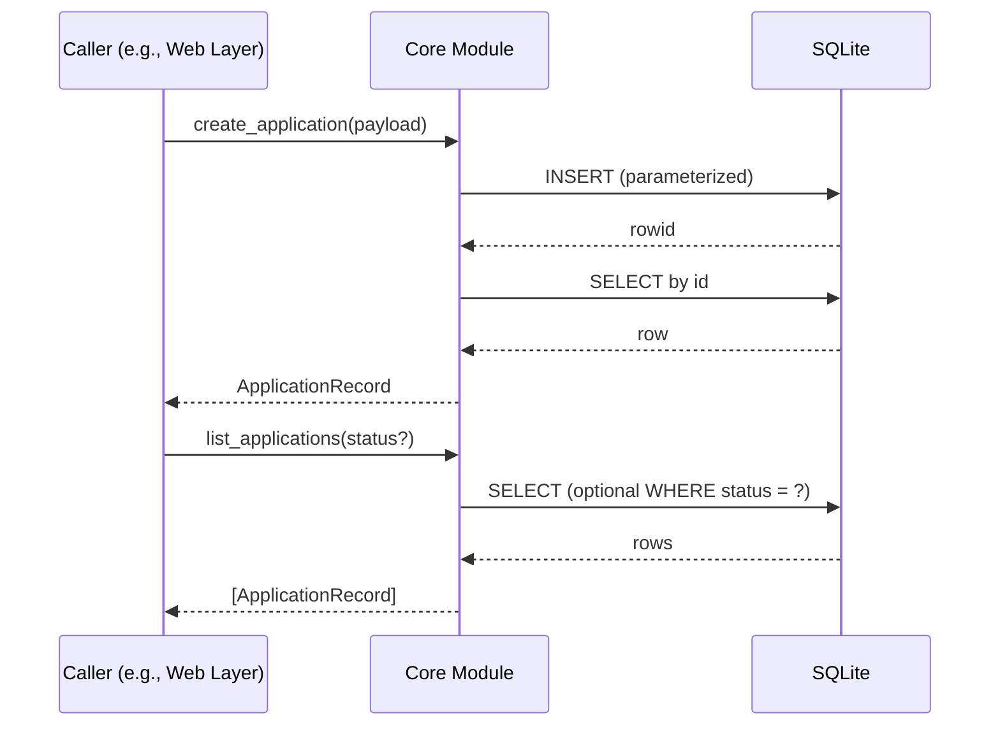

# Design: As a user, I want to manage job applications via a REST API so that I can create, view, update, delete, and filter my applications.

## Overview
The current implementation provides a pure Python core module that encapsulates business logic and SQLite persistence for managing job applications. It exposes functions to create, read, update, delete, and filter applications, performs input validation, applies defaults, and uses parameterized SQL. It does not include a web framework or HTTP handling; instead, it raises structured exceptions that a web layer can translate into HTTP responses. The database is initialized on first use by each public function to ensure required tables and indexes exist.

## Components
- core.applications (scrum_99.py):
  - Public functions:
    - init_db(db_path?): Creates applications table and status index if absent.
    - create_application(payload, db_path?): Validates and inserts a new application; applies defaults.
    - list_applications(status?, db_path?): Lists applications, optionally filtered by status.
    - get_application(app_id, db_path?): Retrieves a single application by id.
    - update_application(app_id, updates, db_path?): Partially updates allowed fields; returns updated record.
    - delete_application(app_id, db_path?): Deletes by id.
  - Schemas (TypedDicts):
    - ApplicationRecord(id, company, role, status, applied_date, notes?)
    - ErrorDetail(field, error)
    - ErrorResponse(message, details?)
  - Errors:
    - ApiError(status_code, message, details?) with to_error_response() helper.
    - BadRequestError(400), NotFoundError(404).
  - Validation helpers:
    - _validate_non_empty_string, _validate_status (enum), _validate_date_yyyy_mm_dd, _validate_notes.
  - Database helpers:
    - _get_connection(db_path) sets row_factory and PRAGMA.
    - _row_to_application maps sqlite3.Row to ApplicationRecord.

## Data Flow
1. Initialization:
   - Each public function invokes init_db(db_path) to ensure the applications table and status index exist.
2. Create:
   - Caller passes payload dict to create_application().
   - Function validates required and optional fields.
   - Defaults applied when omitted (status='applied', applied_date=today).
   - Parameterized INSERT executed; the inserted row is selected and returned as ApplicationRecord.
3. List (optional filtering):
   - Caller optionally passes a status to list_applications().
   - Status is validated (case-insensitive) if provided; invalid value triggers BadRequestError.
   - Parameterized SELECT executed (with WHERE status = ? when filtering), ordered by applied_date DESC, id DESC.
   - Rows mapped to list[ApplicationRecord].
4. Get by id:
   - get_application(app_id) performs a parameterized SELECT by id.
   - If no row, raises NotFoundError; otherwise returns ApplicationRecord.
5. Update (partial):
   - update_application(app_id, updates) verifies the record exists.
   - Validates only provided fields among company, role, status, applied_date, notes.
   - If no valid updatable fields are provided and no validation errors, returns the existing record unchanged.
   - On validation errors, raises BadRequestError.
   - Builds a dynamic parameterized UPDATE for provided fields; selects and returns the updated record.
6. Delete:
   - delete_application(app_id) executes a parameterized DELETE by id.
   - If no rows affected, raises NotFoundError; otherwise returns None.

## Diagram

## Key Decisions
- Decision: Expose a pure Python core module without FastAPI — Rationale: Decouple business logic/persistence from transport; allows any web layer to wrap the module.
- Decision: Manual validation + TypedDicts — Rationale: Keep dependencies minimal; provide structured results and error payloads without Pydantic.
- Decision: SQLite with parameterized SQL — Rationale: Local, simple, and safe parameter binding.
- Decision: Partial updates via a single update function — Rationale: Simpler consumer usage while supporting idempotent merges; if no fields provided, return existing record unchanged.
- Decision: Initialize DB on first use per operation — Rationale: Ensures schema exists without relying on framework startup hooks.

## Edge Cases & Risks
- Invalid status or date: raise BadRequestError with message and field-level details.
- Empty company/role: trimmed and rejected as invalid; BadRequestError.
- Invalid status filter: BadRequestError.
- Nonexistent id on get/update/delete: NotFoundError.
- Concurrency: Each call opens its own SQLite connection; no global connection or thread locks are used. Consumers should manage higher-level concurrency if embedding in a web server.
- Date default timezone: Uses date.today() (local system date), formatted as YYYY-MM-DD.

## Acceptance Criteria (Technical)
- [ ] init_db creates the applications table and an index on status if absent.
- [ ] create_application applies defaults (status='applied', applied_date=today) when omitted and returns an ApplicationRecord with a generated id.
- [ ] list_applications supports optional status filtering; invalid status raises BadRequestError; results are ordered by applied_date DESC, id DESC.
- [ ] get_application returns the ApplicationRecord for an existing id; raises NotFoundError when missing.
- [ ] update_application accepts partial fields, validates them, persists changes, and returns the updated ApplicationRecord; raises NotFoundError when id missing; returns existing record unchanged if no valid updatable fields are provided.
- [ ] delete_application removes the record and returns None on success; raises NotFoundError when id missing.
- [ ] All SQL statements use parameterized queries; errors are raised as ApiError subclasses with to_error_response() producing {"message", "details?"} suitable for a web layer to translate into JSON and HTTP status codes.