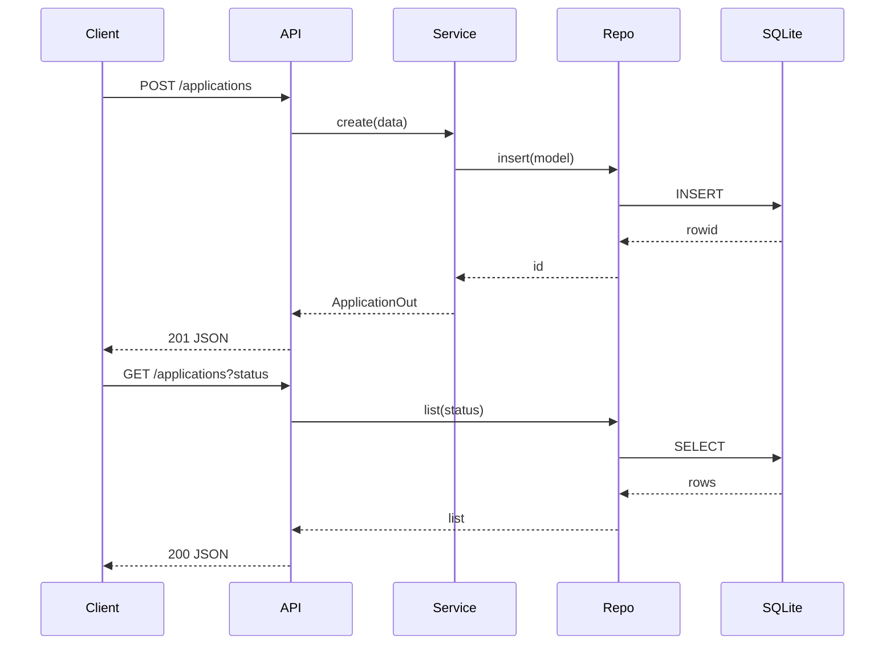

# Design: As a user, I want to manage job applications via a REST API so that I can create, view, update, delete, and filter my applications.

## Overview
Implement a RESTful API using FastAPI with SQLite storage. Define clear schemas and validation with Pydantic, a service layer for business rules (defaults, partial updates), and a repository using prepared SQL statements. Initialize the database on startup, enforce enum/status and date validations, and return consistent JSON responses with proper HTTP status codes.

## Components
- api.server: FastAPI app factory, mounts routes, JSON error handler.
- api.routes.applications: Defines endpoints for /applications CRUD and filtering.
- api.schemas:
  - ApplicationCreate(company, role, status?, applied_date?, notes?)
  - ApplicationUpdate(company?, role?, status?, applied_date?, notes?)
  - ApplicationOut(id, company, role, status, applied_date, notes)
  - ErrorResponse(message, details?)
- domain.validation: Helpers for status enum, non-empty strings, YYYY-MM-DD date parsing.
- domain.service.ApplicationService: Orchestrates create, get, list, update (merge), delete; applies defaults.
- infra.db: SQLite connection factory, PRAGMA setup, init_db() creating tables and indexes.
- infra.repository.ApplicationRepository: CRUD with parameterized SQL; maps rows to dicts.

## Data Flow
1. Startup: api.server calls infra.db.init_db() to create applications table and status index if absent.
2. POST /applications:
   - Router parses JSON to ApplicationCreate.
   - Service sets defaults (status=applied, applied_date=today), validates.
   - Repository inserts via prepared statement; returns new id.
   - Service returns ApplicationOut; 201 response.
3. GET /applications[?status]:
   - Router validates optional status query.
   - Repository selects all or by status.
   - 200 with list of ApplicationOut.
4. GET /applications/:id:
   - Repository fetches by id; if none, raise 404.
   - 200 with ApplicationOut.
5. PUT /applications/:id:
   - Router parses ApplicationUpdate (partial fields allowed).
   - Repository fetches existing; 404 if missing.
   - Service merges fields, validates; repository updates via prepared statement.
   - 200 with updated ApplicationOut.
6. DELETE /applications/:id:
   - Repository deletes by id; if no row, 404; else 204.

## Diagram

## Key Decisions
- Decision: FastAPI + Pydantic — Rationale: Built-in validation, speed, JSON by default.
- Decision: SQLite with prepared SQL — Rationale: Local, simple, safe parameter binding.
- Decision: PUT as partial update — Rationale: Simpler client use while preserving idempotence by merging.

## Edge Cases & Risks
- Invalid status or date: return 400 with message and field errors.
- Empty company/role: trim and reject empty; 400.
- Invalid status filter: 400.
- Nonexistent id on GET/PUT/DELETE: 404.
- Concurrency on SQLite: use a single connection with check_same_thread=False and a thread lock; short transactions.
- Date default timezone: use local date via date.today(), format YYYY-MM-DD.

## Acceptance Criteria (Technical)
- [ ] DB initializes table applications and index on status at startup.
- [ ] POST defaults status to applied and applied_date to today when omitted; returns 201 with id.
- [ ] GET supports status filtering with 400 on invalid status.
- [ ] PUT applies partial updates and returns 200 with updated record; 404 when id missing.
- [ ] DELETE returns 204 on success; 404 when id missing.
- [ ] All errors return application/json with message and details; all SQL use prepared statements.